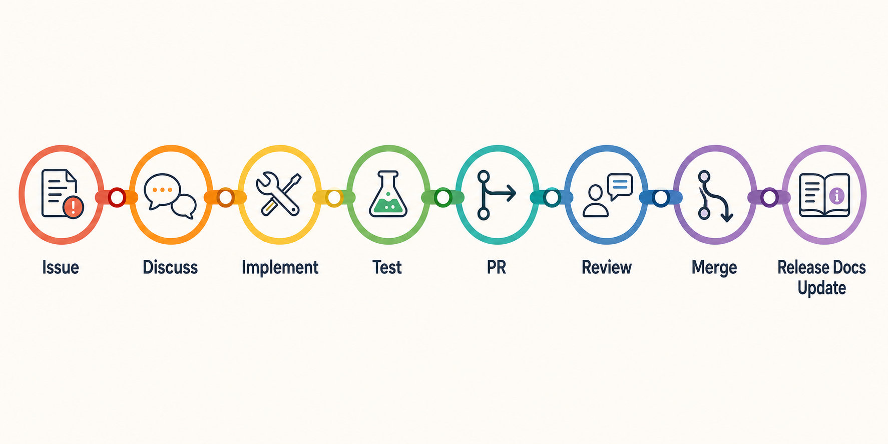

# Contributing To Open Transit RT

Open Transit RT is an independent open-source backend for small transit agencies that need practical GTFS and GTFS Realtime publication tooling.

Contributions are welcome when they stay inside the project boundary: GTFS import and Studio, telemetry ingest, conservative trip matching, GTFS Realtime feeds, Alerts, validation, monitoring, evidence workflows, and admin/operator workflows.


## Where To Start Contributing

Good first contribution areas include:

- docs improvements that make setup, architecture, or evidence boundaries clearer;
- tutorial fixes for local quickstart, agency demo, deployment, and readiness guides;
- replay fixtures under `testdata/replay/` that document current realtime behavior;
- bug reproduction with exact commands, inputs, expected behavior, and redacted output;
- tests for focused behavior changes;
- operator runbooks that make deployment and maintenance safer;
- issue triage that links related docs, asks for missing reproduction details, or flags secret-safety concerns.

Beginner-safe issues should be small, self-contained, and avoid changing public feed contracts, database schema, authentication behavior, or evidence claims.

## Before You Build

Check these before opening a PR:

- Does this change affect public feed URLs?
- Does it change GTFS-RT protobuf contracts or feed semantics?
- Does it change evidence, consumer, readiness, or compliance wording?
- Does it add secrets, operator artifacts, raw logs, private URLs, or credential-shaped data?
- Does it need an ADR in `docs/decisions.md`?
- Does it keep Trip Updates pluggable and Vehicle Positions first?
- Does it preserve the rule that unknown is better than false certainty?

If the answer is yes for feed contracts, evidence claims, security boundaries, deployment posture, or architecture direction, keep the change narrow and update the relevant docs.

## Local Setup

Start with:

```bash
make validate
make test
git diff --check
```

For a local full-stack evaluation:

```bash
make agency-app-up
```

For validator-backed workflows:

```bash
make validators-install validators-check
```

For replay quality checks:

```bash
make realtime-quality
```

For HTTP hardening smoke coverage:

```bash
make smoke
```

The local app package is for local evaluation only. It does not prove hosted SaaS availability, agency-owned production readiness, consumer acceptance, or CAL-ITP/Caltrans compliance.

## Development Expectations

- Keep backend work mostly in Go.
- Prefer existing internal package boundaries over new abstractions.
- Keep handlers, feed builders, validators, predictors, and repositories decoupled.
- Keep Trip Updates behind `internal/prediction.Adapter`.
- Keep draft GTFS and published feed versions separate.
- Prefer deterministic tests and committed fixtures for transit edge cases.
- Do not add rider apps, fare payments, passenger accounts, or CAD/dispatch scope.

For meaningful code changes, add or update tests. For docs-only changes, no Go tests are required, but run the required checks listed below.

## Docs And Evidence Rules

Docs and evidence changes must be truthful and specific.

Allowed wording includes:

- "implements technical foundations";
- "supports deployment toward readiness";
- "prepared packet";
- "hosted/operator evidence for the OCI pilot."

Do not claim:

- CAL-ITP/Caltrans compliance;
- consumer submission, review, ingestion, or acceptance without retained evidence;
- agency endorsement;
- hosted SaaS availability;
- marketplace/vendor equivalence;
- paid support or SLA coverage;
- universal production readiness;
- production-grade ETA quality from replay metrics alone.

Prepared consumer packets are review artifacts only. They are not submissions. OCI pilot evidence is pilot evidence, not agency-owned production proof.

Follow `docs/evidence/redaction-policy.md` for evidence work.

## Secret Safety

Never paste or commit:

- tokens, JWTs, API keys, CSRF secrets, device tokens, or admin tokens;
- database URLs with passwords;
- private keys, private certificates, or ACME material;
- admin URLs with embedded secrets;
- private portal screenshots or private ticket links;
- raw logs with credentials;
- raw telemetry payloads that contain private operator data;
- unredacted operator artifacts.

Use redacted logs and public-safe evidence. If a secret is exposed, follow `SECURITY.md` and rotate or revoke the credential before making public claims about remediation.

## Pull Requests



Every PR should include:

- a clear summary of what changed;
- tests or a reason tests are not needed;
- docs updates when behavior, setup, evidence, support, or operations changed;
- a statement about evidence/truthfulness impact when readiness or consumer wording changed;
- confirmation that no secrets or private operator artifacts were added.

Maintainers may ask for smaller changes if a PR mixes unrelated feature, docs, evidence, and operations updates.

## Checks Before Submitting

Run:

```bash
make validate
make test
git diff --check
```

Also run these when readiness/evidence docs, realtime behavior, or operations docs change materially:

```bash
make realtime-quality
make smoke
docker compose -f deploy/docker-compose.yml config
```

If a required check cannot run, say exactly why in the PR.

