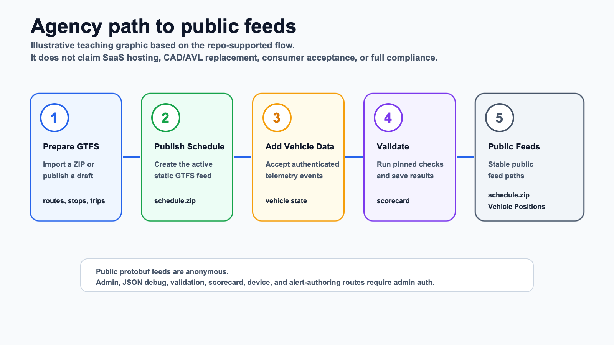

# Open Transit RT

[](https://github.com/ptse8204/open-transit-rt)

Open Transit RT is open-source tooling for small transit agencies that need a practical path to publish static GTFS and GTFS Realtime feeds.

It is meant for agencies, civic technologists, operators, and evaluators who want to understand or run a lightweight backend for schedule publication, vehicle telemetry, validation, and public feed URLs.

## What This Is

- Open-source tooling to help agencies publish GTFS and GTFS Realtime feeds.
- A mostly Go backend with Postgres/PostGIS, GTFS import, GTFS Studio drafts, authenticated vehicle telemetry, conservative trip assignment, public feed builders, Alerts, validation workflow records, and readiness evidence tracking.
- A project that helps agencies move toward Caltrans/CAL-ITP-style readiness when paired with real hosting, operations, and evidence.

## What This Is Not

- Not a hosted SaaS product.
- Not a CAD/AVL replacement.
- Not proof of consumer acceptance by itself.
- Not a claim of full CAL-ITP/Caltrans compliance or universal production readiness.



*Illustrative teaching graphic, not a product screenshot. It shows the project path without claiming hosted SaaS, CAD/AVL replacement, consumer acceptance, or full compliance.*

## What You Can Use Now

Open Transit RT can:

- import static GTFS ZIP files or publish typed GTFS Studio drafts
- persist authenticated vehicle telemetry
- preserve conservative vehicle assignment state
- publish stable public paths for `schedule.zip`, `feeds.json`, Vehicle Positions, Trip Updates, and Alerts
- keep Trip Updates behind a replaceable prediction adapter
- run validation workflows and store readiness/consumer-ingestion records
- run an executable local agency demo from the committed project files

Public feed paths are:

```text
/public/gtfs/schedule.zip
/public/feeds.json
/public/gtfsrt/vehicle_positions.pb
/public/gtfsrt/trip_updates.pb
/public/gtfsrt/alerts.pb
```

Admin, JSON debug, GTFS Studio, validation, scorecard, device, and alert-authoring routes require admin auth.

## Quick Actions

| I want to... | Start here |
| --- | --- |
| 🧭 Understand the project | [How It Works](wiki/how-it-works.md) |
| 💻 Try it locally | [Local Quickstart](wiki/local-quickstart.md) |
| 🚌 See the agency demo | [Agency Demo](wiki/agency-demo.md) |
| 🚀 Plan a pilot deployment | [Deployment Guide](wiki/deployment-guide.md) |
| ✅ Review readiness evidence | [Readiness And Evidence](wiki/readiness-and-evidence.md) |
| ⭐ Support the project | [Star this repo](https://github.com/ptse8204/open-transit-rt) |

## Try It Locally

Prerequisites: Go, Docker with Compose, `curl`, `zip`, `unzip`, Java for the static GTFS validator, and `python3` for the GTFS-RT validator wrapper.

```bash
cp .env.example .env
make dev
make validators-install
make validators-check
make demo-agency-flow
```

The demo imports sample GTFS, starts the Open Transit RT services, publishes local feed metadata, ingests token-authenticated telemetry, fetches public feeds, verifies protected admin/debug access, runs validation, and reads scorecard plus consumer-ingestion records.

More public guides:

- [Wiki Home](wiki/README.md)
- [How It Works](wiki/how-it-works.md)
- [Local Quickstart](wiki/local-quickstart.md)
- [Agency Demo](wiki/agency-demo.md)
- [Deployment Guide](wiki/deployment-guide.md)
- [Readiness And Evidence](wiki/readiness-and-evidence.md)
- [Support And Contribute](wiki/support-and-contribute.md)

## Readiness And Evidence

Use these links to understand what the project can show today and what still needs real deployment or third-party evidence:

- [Public Readiness And Evidence Guide](wiki/readiness-and-evidence.md)
- [Project Status](docs/current-status.md)
- [Latest Maintainer Notes](docs/handoffs/latest.md)
- [Compliance Evidence Checklist](docs/compliance-evidence-checklist.md)
- [Consumer Submission Evidence](docs/consumer-submission-evidence.md)
- [Consumer Submission Tracker](docs/evidence/consumer-submissions/README.md)
- [OCI Pilot Evidence Packet](docs/evidence/captured/oci-pilot/2026-04-24/README.md)

Maintainer and agent reference docs:

- [Internal Docs Home](docs/README.md)
- [Architecture](docs/architecture.md)
- [Dependencies](docs/dependencies.md)
- [Decisions](docs/decisions.md)
- [Known Gaps](docs/repo-gaps.md)
- [Maintainer History](docs/handoffs/)

Validator success, public fetch proof, hosted operator evidence, and consumer-ingestion workflow records are useful readiness signals. They are not the same as third-party consumer acceptance.

## Important Boundaries

Open Transit RT is intentionally scoped:

- Hosted login/SSO belongs outside this project today.
- Universal production operations guarantees require deployment-specific work.
- External predictor integrations such as TheTransitClock are future adapter work.
- Consumer submission API integrations are outside the available product surface.
- Google Maps, Apple Maps, Transit App, or other consumer acceptance requires real third-party evidence.
- Full CAL-ITP/Caltrans compliance requires deployment and evidence beyond the project files.

## Support Or Contribute

⭐ **[Star Open Transit RT](https://github.com/ptse8204/open-transit-rt)** if the project is useful to you. A GitHub star is a simple way to show support, similar to a like or bookmark. For an independent open-source project, stars help more people discover the work, help show that the project is useful, and support continued work on it. A star is not an official agency endorsement.

Useful contributions include focused issues, reproducible demo failures, validator findings, clearer docs, deployment notes, and small-agency workflow feedback.

Please keep requests inside the product boundary: GTFS import/Studio, telemetry ingest, deterministic matching, GTFS-RT feeds, Alerts, validation, monitoring, and admin/operator workflows.
