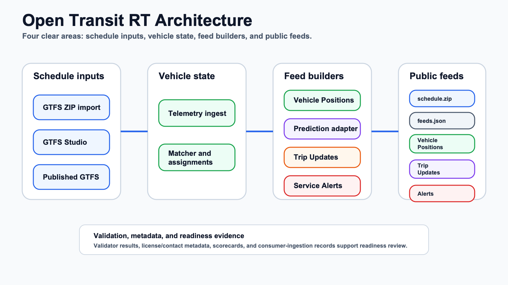

# Open Transit RT

Open Transit RT is a modular transit data platform for small agencies that need to publish static GTFS and GTFS Realtime feeds without buying a full CAD/AVL replacement.

The current codebase focuses on the agency-operated backend path:
- import or author static GTFS
- persist authenticated vehicle telemetry
- preserve conservative trip-assignment state
- publish stable GTFS and GTFS Realtime feed URLs
- keep Trip Updates behind a replaceable prediction adapter
- expose validation, publication metadata, scorecard, Alerts, and consumer-ingestion workflow records

This repository is production-directed, but it is not a hosted turnkey service and it should not be described as universally production ready. It implements the technical foundations needed to deploy toward Caltrans/CAL-ITP-style transit data readiness, including stable URLs, validation workflows, open-license/contact metadata, and consumer-ingestion workflow records. A real deployment still needs HTTPS, operations, validator evidence, monitoring, and consumer acceptance before stronger compliance claims are justified.

For the evidence-by-evidence Phase 11 mapping, see [Compliance Evidence Checklist](docs/compliance-evidence-checklist.md).



## What Works Today

Implemented in the Phase 9 codebase:
- Postgres/PostGIS-backed migrations and local bootstrap.
- GTFS ZIP import with internal validation and atomic active-feed publication.
- Minimal server-rendered GTFS Studio for typed draft rows and draft publishing.
- Authenticated telemetry ingest using opaque device Bearer tokens bound to agency, device, and vehicle.
- Conservative persisted assignment model used by feed builders; automatic matching logic exists in `internal/state`, but there is no standalone matcher daemon in Phase 10.
- Public GTFS Schedule ZIP generated from the active published GTFS feed.
- Public GTFS-RT Vehicle Positions protobuf from latest accepted telemetry plus current assignments.
- Public GTFS-RT Trip Updates protobuf through the deterministic prediction adapter, withholding weak or unsupported cases.
- Public GTFS-RT Alerts protobuf from persisted published Service Alerts.
- Protected JSON debug views for schedule/realtime/admin inspection.
- Admin JWT auth with DB-backed roles, cookie CSRF protection for browser admin flows, and production secret checks.
- Publication metadata bootstrap, `/public/feeds.json`, consumer-ingestion records, validator records, and compliance scorecard snapshots.
- Pinned validator tooling workflow for MobilityData static GTFS Validator and a Docker-backed GTFS-RT validator wrapper.

## Public Endpoints

Public feed endpoints are anonymous by design:

| Feed | Endpoint |
| --- | --- |
| Static GTFS | `/public/gtfs/schedule.zip` |
| Feed discovery metadata | `/public/feeds.json` |
| Vehicle Positions | `/public/gtfsrt/vehicle_positions.pb` |
| Trip Updates | `/public/gtfsrt/trip_updates.pb` |
| Alerts | `/public/gtfsrt/alerts.pb` |

`/public/gtfs/schedule.zip` returns `ETag`, `Last-Modified`, and `X-Checksum-SHA256`. The realtime protobuf endpoints return valid GTFS Realtime `FeedMessage` payloads, including successful empty feeds when there is no publishable entity.

In a deployment, put a reverse proxy in front of the services so these public paths share one stable HTTPS feed root.

## Admin And Debug Surfaces

Admin, mutation, and JSON debug routes require admin auth. Bearer JWT auth is the default for API use; `admin_session` cookie auth exists for browser-admin flows and requires CSRF on unsafe methods.

Protected routes include:
- `/public/gtfsrt/vehicle_positions.json` and `/admin/debug/gtfsrt/vehicle_positions.json`
- `/public/gtfsrt/trip_updates.json` and `/admin/debug/gtfsrt/trip_updates.json`
- `/public/gtfsrt/alerts.json` and `/admin/debug/gtfsrt/alerts.json`
- `/v1/events` and `/admin/debug/telemetry/events`
- `/admin/publication/bootstrap`
- `/admin/compliance/scorecard`
- `/admin/consumer-ingestion`
- `/admin/validation/run`
- `/admin/devices/rebind`
- `/admin/alerts` and alert lifecycle routes
- `/admin/gtfs-studio` and draft subroutes

Generate a local admin token after seeding:

```bash
export ADMIN_JWT_SECRET=dev-admin-jwt-secret-change-me
export ADMIN_JWT_ISSUER=open-transit-rt-local
export ADMIN_JWT_AUDIENCE=open-transit-rt-admin
export CSRF_SECRET=dev-csrf-secret-change-me
export DEVICE_TOKEN_PEPPER=dev-device-token-pepper-change-me

ADMIN_TOKEN="$(go run ./cmd/admin-token -sub admin@example.com -agency-id demo-agency | sed -n 's/^token=//p')"
curl -H "Authorization: Bearer $ADMIN_TOKEN" http://localhost:8086/admin/gtfs-studio
```

## Local Quickstart

Prerequisites:
- Go matching `go.mod`
- Docker with Compose support
- `curl`, `zip`, and `unzip` for the demo wrapper
- Java if you want the static GTFS validator JAR to execute successfully; missing Java is recorded as validator failure, not as feed success

Start with the one-command bootstrap:

```bash
cp .env.example .env
make dev
```

Install and check pinned validators:

```bash
make validators-install
make validators-check
```

Run the executable agency demo flow:

```bash
make demo-agency-flow
```

The demo imports `testdata/gtfs/valid-small`, starts local services, publishes metadata, ingests token-authenticated telemetry, fetches `schedule.zip`, `feeds.json`, and the realtime protobuf feeds, verifies protected debug/admin access including GTFS Studio, runs validation, and reads the scorecard plus consumer-ingestion records.

For the full step-by-step path, see [Local Quickstart](docs/tutorials/local-quickstart.md) and [Agency Demo Flow](docs/tutorials/agency-demo-flow.md).

## Running Services Manually

The local defaults use Postgres on host port `55432`.

```bash
make db-up
make migrate-up
make seed
```

Run services in separate terminals:

```bash
make run-agency-config          # http://localhost:8081
make run-telemetry-ingest       # http://localhost:8082
make run-feed-vehicle-positions # http://localhost:8083
make run-feed-trip-updates      # http://localhost:8084
make run-feed-alerts            # http://localhost:8085
make run-gtfs-studio            # http://localhost:8086
```

Task is optional:

```bash
task dev
task demo:agency
```

The Makefile remains the supported fallback when Task is not installed.

## Deployment Path

The current Docker Compose file provisions Postgres/PostGIS only. The Go services are run as application processes using the same binaries and environment variables documented in `.env.example`.

For a small agency pilot:
- run Postgres/PostGIS from Compose or a managed database
- run migrations with `go run ./cmd/migrate up`
- run each Go service under a process manager or container image owned by the deployment
- put a TLS-terminating reverse proxy in front of public feed paths
- keep admin/debug routes behind auth and network controls
- install pinned validators with `make validators-install validators-check` or bake equivalent pinned artifacts into the runtime image
- set real production secrets and `APP_ENV=production`

See [Deploy With Docker Compose](docs/tutorials/deploy-with-docker-compose.md) and [Production Checklist](docs/tutorials/production-checklist.md).

For deployment evidence packaging runbooks/templates (Phase 12 Step 1 scaffolding), see [Deployment Evidence Overview](docs/runbooks/deployment-evidence-overview.md) and [docs/evidence/README.md](docs/evidence/README.md).

## Validation And Readiness

Repo-supported validator setup:

```bash
make validators-install
make validators-check
make validate
make smoke
make test
```

Pinned tooling:
- MobilityData GTFS Validator `v7.1.0`, checksum-verified into `.cache/validators/`
- Docker-backed GTFS-RT validator wrapper pinned by image digest in `tools/validators/validators.lock.json`

Admin validation requests are server-side allowlisted. `/admin/validation/run` accepts only:

```json
{
  "validator_id": "static-mobilitydata",
  "feed_type": "schedule"
}
```

or:

```json
{
  "validator_id": "realtime-mobilitydata",
  "feed_type": "vehicle_positions"
}
```

Valid `feed_type` values are `schedule`, `vehicle_positions`, `trip_updates`, and `alerts` where supported by the selected validator.

The repository can record and report readiness evidence, but local checks and demo output are not the same as deployment compliance. Use [Compliance Evidence Checklist](docs/compliance-evidence-checklist.md) to separate repo-proven capability, deployment/operator proof, and third-party consumer confirmation.

## Current Limitations

Do not overstate the current repo:
- No hosted login/SSO UI.
- No packaged production app containers or Kubernetes manifests.
- No full SLO dashboard or alerting stack beyond request logs, request IDs, readiness checks, and optional `/metrics`.
- No OpenTelemetry tracing/exporter or Prometheus/Grafana deployment assets.
- No server-side admin JWT `jti` replay tracking.
- No external predictor integration such as TheTransitClock.
- Trip Updates are conservative schedule-deviation predictions, not learned production-grade ETA quality.
- Consumer-ingestion records exist, but the app does not submit feeds to Google Maps, Apple Maps, Transit App, or other consumers.
- The repo supports deployment toward CAL-ITP/Caltrans-style readiness; it does not prove full compliance or consumer acceptance by itself.

## Support The Project

If this project is useful, star the repository, try the demo flow, and open focused issues with exact commands, logs, and expected behavior. The most valuable feedback is practical: deployment blockers, validator failures, confusing docs, or small-agency workflows that the current backend does not yet handle.

Please keep feature requests inside the product boundary: GTFS import/Studio, telemetry ingest, deterministic matching, GTFS-RT feeds, Alerts, validation, monitoring, and admin/operator workflows.
