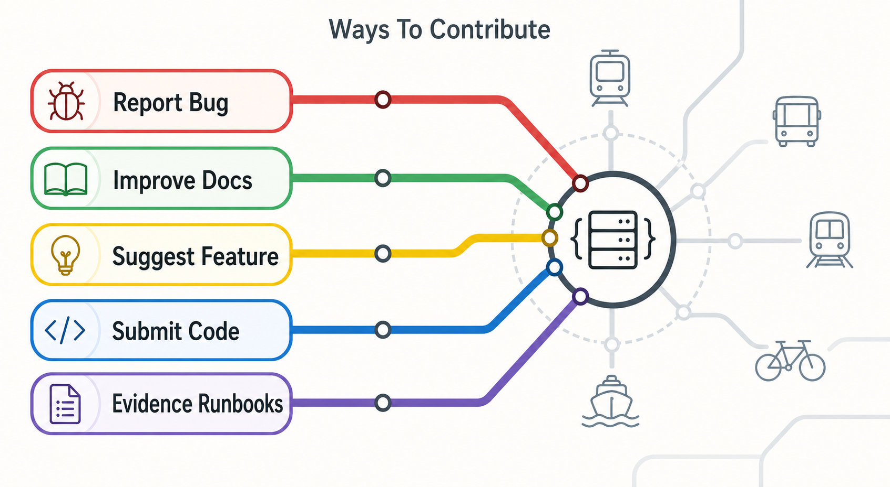

# Documentation Home

Use this page to find the right guide without reading the whole repository history.

If you are new to Open Transit RT, start with the public guides. If you are maintaining the repo, reviewing evidence, or continuing implementation work, use the deeper reference sections below.

## Start Here

| Need | Guide |
| --- | --- |
| 🧭 Understand the project | [Wiki Home](../wiki/README.md) |
| 🧩 See how the pieces fit together | [How It Works](../wiki/how-it-works.md) |
| 🚌 Start the local app package | [Agency First Run](tutorials/agency-first-run.md) |
| 💻 Run it locally | [Local Quickstart](../wiki/local-quickstart.md) |
| 🚌 Try the agency demo | [Agency Demo](../wiki/agency-demo.md) |
| 🚀 Plan a small deployment | [Deployment Guide](../wiki/deployment-guide.md) |
| ✅ Review readiness and evidence | [Readiness And Evidence](../wiki/readiness-and-evidence.md) |
| 🤝 Support or contribute | [Support And Contribute](../wiki/support-and-contribute.md) |
| 🧑‍💻 Contribute safely | [Contributing](../CONTRIBUTING.md) |

## Practical Guides

These are command-level references for people running or evaluating the project:

- [Local Quickstart](tutorials/local-quickstart.md)
- [Agency First Run](tutorials/agency-first-run.md)
- [Agency Demo Flow](tutorials/agency-demo-flow.md)
- [Deploy With Docker Compose](tutorials/deploy-with-docker-compose.md)
- [Production Checklist](tutorials/production-checklist.md)
- [Small-Agency Pilot Operations](runbooks/small-agency-pilot-operations.md)
- [CAL-ITP Readiness Checklist](tutorials/calitp-readiness-checklist.md)

## Readiness And Evidence

These pages explain what evidence exists and what it can, and cannot, prove:

- [Compliance Evidence Checklist](compliance-evidence-checklist.md)
- [California Readiness Summary](california-readiness-summary.md)
- [Agency-Owned Domain Readiness](agency-owned-domain-readiness.md)
- [Consumer Submission Evidence](consumer-submission-evidence.md)
- [Consumer Submission Tracker](evidence/consumer-submissions/README.md)
- [Consumer Submission Workflow](evidence/consumer-submissions/submission-workflow.md)
- [Consumer Packet Index](evidence/consumer-submissions/packets/README.md)
- [Consumer Artifact Intake](evidence/consumer-submissions/artifacts/README.md)
- [Consumer Status JSON](evidence/consumer-submissions/status.json)
- [Marketplace And Vendor Gap Review](marketplace-vendor-gap-review.md)
- [OCI Pilot Evidence Packet](evidence/captured/oci-pilot/2026-04-24/README.md)
- [Captured Evidence Index](evidence/captured/README.md)

## Architecture And Dependencies

Use these when checking product boundaries, integration points, and design decisions:

- [Architecture](architecture.md)
- [Dependencies](dependencies.md)
- [Decisions](decisions.md)
- [Known Gaps](repo-gaps.md)
- [Requirements 2A-2F](requirements-2a-2f.md)
- [Trip Updates Requirements](requirements-trip-updates.md)
- [CAL-ITP / Caltrans Requirements](requirements-calitp-compliance.md)

## Maintainer Notes

These pages preserve detailed project state and history for maintainers and future agents:

- [Contributing](../CONTRIBUTING.md)
- [Code Of Conduct](../CODE_OF_CONDUCT.md)
- [Governance](governance.md)
- [Release Process](release-process.md)
- [Support Boundaries](support-boundaries.md)
- [Multi-Agency Strategy](multi-agency-strategy.md)
- [Roadmap Status](roadmap-status.md)
- [Current Status](current-status.md)
- [Latest Continuation Notes](handoffs/latest.md)
- [Maintainer History](handoffs/)
- [Documentation Assets](assets/README.md)

Public-facing pages should stay plain and reader-friendly. Detailed evidence records, operational notes, and implementation history belong here rather than in the top-level README.
