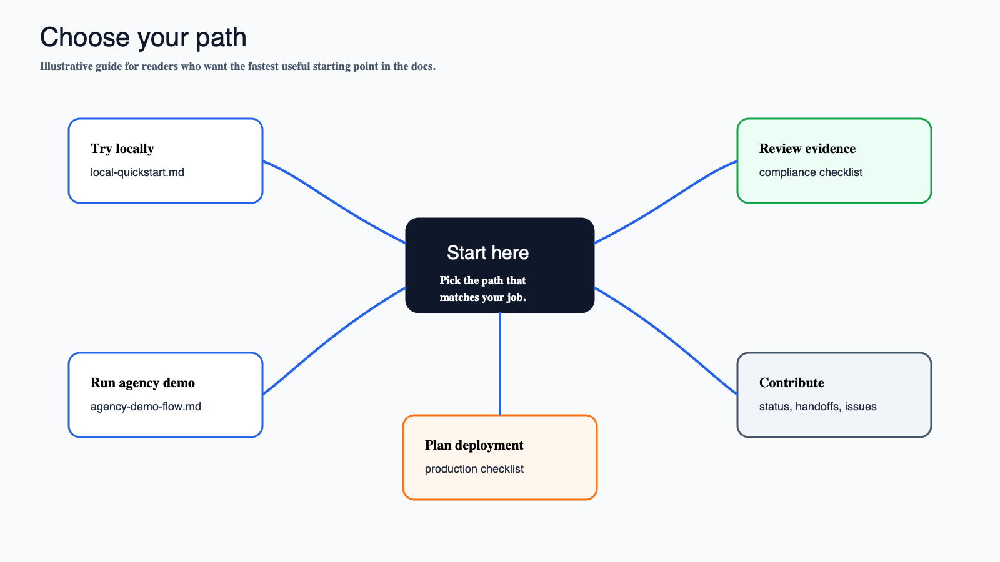
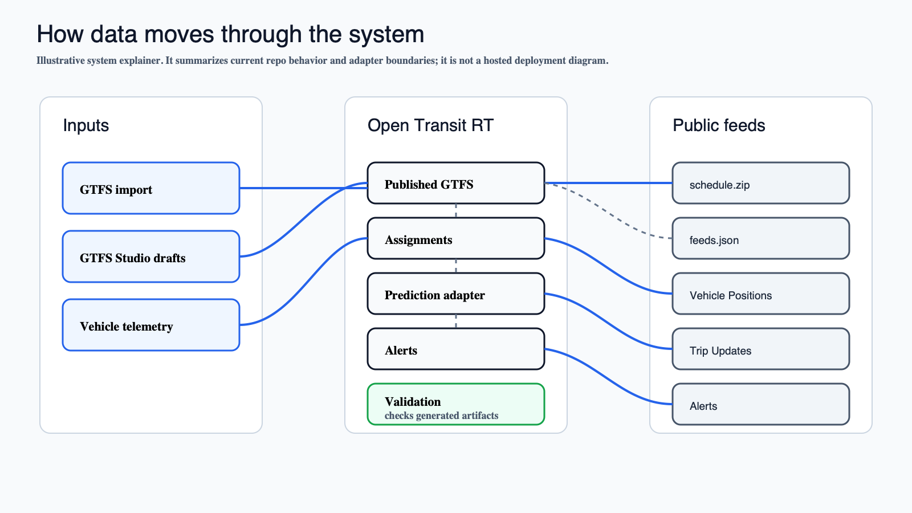

# Documentation Home

This is the best starting point after the README. Pick the path that matches what you need to do.

*Illustrative docs navigation graphic, not an exact app screenshot.*

## Start Here

| Goal | Read |
| --- | --- |
| Understand current capability | [Current Status](current-status.md) |
| Try the repo locally | [Local Quickstart](tutorials/local-quickstart.md) |
| Run the executable agency demo | [Agency Demo Flow](tutorials/agency-demo-flow.md) |
| Plan a small deployment path | [Deploy With Docker Compose](tutorials/deploy-with-docker-compose.md) |
| Check production-readiness gaps | [Production Checklist](tutorials/production-checklist.md) |
| Review CAL-ITP/Caltrans-style readiness | [CAL-ITP Readiness Checklist](tutorials/calitp-readiness-checklist.md) |
| Review compliance evidence boundaries | [Compliance Evidence Checklist](compliance-evidence-checklist.md) |
| Review consumer-submission status | [Consumer Submission Evidence](consumer-submission-evidence.md) and [Consumer Submission Tracker](evidence/consumer-submissions/README.md) |
| Continue from the latest phase state | [Latest Handoff](handoffs/latest.md) |
| Understand dependencies and decisions | [Dependencies](dependencies.md) and [Decisions](decisions.md) |

## How The System Fits Together

*Illustrative system explainer based on current repo behavior. It is not a hosted deployment diagram and does not claim consumer acceptance or full compliance.*

Open Transit RT keeps the core boundaries small:

- GTFS ZIP import and GTFS Studio drafts publish into the active static GTFS model.
- Vehicle telemetry is authenticated and persisted before it is used for realtime feeds.
- Trip Updates stay behind a prediction adapter boundary.
- Public protobuf feeds are anonymous; admin and debug surfaces require auth.
- Validation, scorecard, deployment evidence, and consumer-submission evidence are tracked separately from claims of acceptance or compliance.

## More Navigation

- [Tutorials](tutorials/README.md)
- [Docs Assets](assets/README.md)
- [Phase 14 Launch Polish Plan](phase-14-public-launch-polish.md)
- [Handoff History](handoffs/)
- [Evidence Overview](evidence/README.md)

Starring the repo helps more people discover the project and shows support for continued independent open-source work. It is not an agency endorsement.
