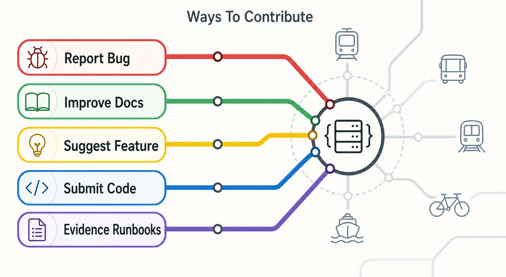

# Documentation Home

Use this page when the wiki does not go deep enough. Public readers should
start with the task guides first; maintainers can use the lower sections for
release, evidence, claim-boundary, and project-history references.

## Public User Docs

- [Small Agency Quick Start](../wiki/small-agency-quick-start.md)
- [Browser-First Setup](../wiki/browser-first-setup.md)
- [Operations Console Tour](../wiki/operations-console-tour.md)
- [Can My Agency Use This?](../wiki/can-my-agency-use-this.md)
- [Agency Evaluation Checklist](../wiki/agency-adoption-checklist.md)
- [CAL-ITP Readiness Plain English](../wiki/calitp-readiness-plain-english.md)

These pages answer what you can do in the UI, what still needs a technical
helper, and what the local evaluation does not prove.

## Operator Docs

- [Agency First Run](tutorials/agency-first-run.md)
- [Small-Agency Acceptance Script](tutorials/small-agency-acceptance-script.md)
- [Reusable Agency Onboarding](tutorials/reusable-agency-onboarding.md)
- [Self-Hosted Operator Trial](tutorials/self-hosted-operator-trial.md)
- [Agency Launchpad](tutorials/agency-launchpad.md)
- [Operator Smoke And Support Bundle](tutorials/operator-smoke-and-support-bundle.md)
- [GTFS Validation Triage](tutorials/gtfs-validation-triage.md)
- [CAL-ITP Readiness Checklist](tutorials/calitp-readiness-checklist.md)
- [Deploy With Docker Compose](tutorials/deploy-with-docker-compose.md)
- [Reference Deployment Doctor](deployment/reference-deployment-doctor.md)

## Integrator Docs

- [Integration Adapter Kit](integration-adapter-kit.md)
- [Connector Plugin Contract](connectors/plugin-contract.md)
- [Connector Cookbook](../wiki/connector-cookbook.md)
- [Device And AVL Integration](tutorials/device-avl-integration.md)
- [Device Token Lifecycle](tutorials/device-token-lifecycle.md)
- [External Adapter Conformance](tutorials/external-adapter-conformance.md)
- [External Connection Readiness](external-connection-readiness.md)
- [Examples Index](../examples/README.md)
- [Test Fixture Index](../testdata/README.md)
- [Dependencies](dependencies.md)

## Release-Candidate Docs

- [Release-Candidate Readiness](release-candidate-readiness.md)
- [Release Process](release-process.md)
- [Release Checklist](release-checklist.md)
- [Release Notes Template](release-notes-template.md)
- [Upgrade And Rollback](upgrade-and-rollback.md)
- [Demo And Documentation Site Plan](demo-docs-site-plan.md)
- [Changelog](../CHANGELOG.md)

Release-candidate checks are local maintainer diagnostics. They do not tag,
publish, push images, create retained evidence, or prove production readiness.

## Evidence And Claim-Boundary Docs

- [Readiness And Evidence](../wiki/readiness-and-evidence.md)
- [Compliance Evidence Checklist](compliance-evidence-checklist.md)
- [California Readiness Summary](california-readiness-summary.md)
- [CAL-ITP / Caltrans Requirements](requirements-calitp-compliance.md)
- [Phase 60 Final Claim Review](phase-60-final-claim-review-and-public-closeout.md)
- [Consumer Submission Evidence](consumer-submission-evidence.md)
- [Consumer Submission Tracker](evidence/consumer-submissions/README.md)
- [Consumer Submission Workflow](evidence/consumer-submissions/submission-workflow.md)
- [Captured Evidence Index](evidence/captured/README.md)

Formal agency approval, final feed-root evidence, and consumer acceptance are
not required for local evaluation or open-source contribution. They are future
authorization-gated evidence tracks only when a maintainer explicitly supplies
the required scope, retention, redaction, and stop conditions.

## Architecture And Requirements

- [Architecture](architecture.md)
- [Dependencies](dependencies.md)
- [Decisions](decisions.md)
- [Known Gaps](repo-gaps.md)
- [Requirements 2A-2F](requirements-2a-2f.md)
- [Trip Updates Requirements](requirements-trip-updates.md)
- [CAL-ITP / Caltrans Requirements](requirements-calitp-compliance.md)

## Maintainer Docs And History

Detailed phase history and notes are retained as project history. They should
not be the first path for a small-agency evaluator.

- [Current Status](current-status.md)
- [Latest Handoff](handoffs/latest.md)
- [Phase 61+ Product Roadmap](roadmaps/agency-first-connector-platform/README.md)
- [Historical Post-60 Product Roadmap](post-60-product-roadmap.md)
- [Roadmap Status](roadmap-status.md)
- [Backlog](backlog.md)
- [Open Questions](open-questions.md)
- [Maintainer Handoffs](handoffs/)
- [Documentation Assets](assets/README.md)

Public-facing pages should stay task-based and reader-friendly. Detailed
evidence records, operational notes, and implementation history belong in the
deeper docs instead of the top-level README.
