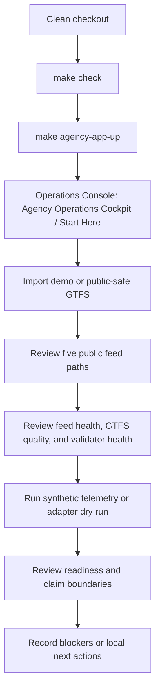
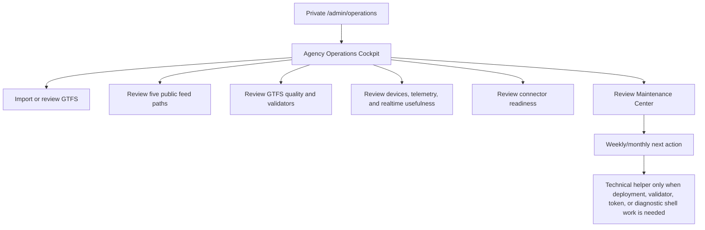
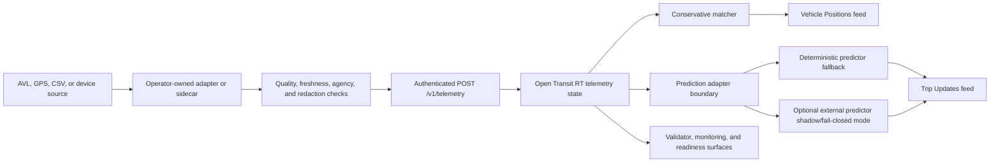
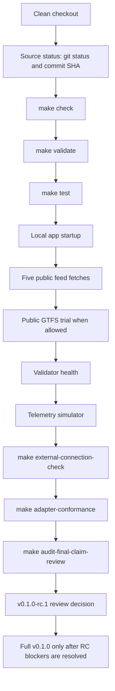

# Product Diagrams

These diagrams make the technical docs easier to read. They are documentation
aids only, not retained evidence and not proof of production readiness,
CAL-ITP/Caltrans compliance, agency adoption or approval, consumer submission
or acceptance, final-root readiness, hosted SaaS availability, SLA coverage,
vendor compatibility, hardware certification, or production-grade ETA quality.

Use Markdown or Mermaid so the source stays reviewable.

## Self-Hosted Operator Flow

**What this proves:** a local/demo operator can follow the product workflow and
find the right private UI surfaces.

**What this does not prove:** production readiness, agency approval, final-root
readiness, consumer acceptance, compliance, hosted SaaS, SLA coverage, vendor
compatibility, or production-grade ETA quality.

## No-CLI Agency Operations Flow

**What this proves:** a local/demo operator has a browser-first path for
routine setup, feed review, quality review, realtime usefulness, connector
review, and maintenance decisions.

**What this does not prove:** agency adoption, compliance, consumer
acceptance, final-root readiness, hosted service availability, production
readiness, vendor compatibility, SLA coverage, or production-grade ETA
quality.

## External-Connection Flow

**What this proves:** connectors have a documented local boundary and a safer
evaluation path.

**What this does not prove:** named vendor compatibility, hardware
certification, real AVL reliability, consumer acceptance, production readiness,
or production-grade ETA quality.

## Release-Candidate Readiness Flow

**What this proves:** a maintainer has a repeatable local release-candidate
diagnostic path and blocker list.

**What this does not prove:** a release has been published, production
readiness, compliance, consumer status, agency adoption or approval,
agency-owned final-root readiness, hosted SaaS availability, SLA coverage,
vendor compatibility, or production-grade ETA quality.

## Review Rules

- Keep diagrams product- and workflow-focused.
- Do not call diagrams evidence.
- Do not add agency logos, vendor logos, real transit photos, private URLs,
  private identifiers, emails, IPs, tokens, or secrets.
- Link to the canonical
  [Review And Recommendations](../../roadmap-status.md#review-and-recommendations)
  instead of duplicating the full scorecard in every doc.
