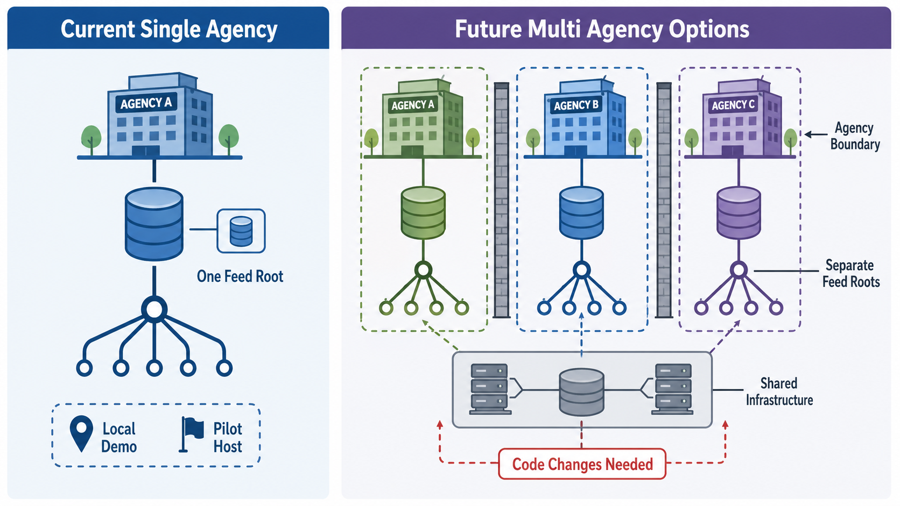

# Multi-Agency Strategy

This document records the current multi-agency posture and the work needed before Open Transit RT could be operated as a true hosted multi-tenant service.

It does not claim hosted SaaS availability, agency endorsement, paid support, SLA coverage, consumer acceptance, or universal production readiness.

## Current Model

The current repository supports local evaluation and a pilot-style single-agency deployment model:

- one deployment stack;
- one primary agency context per local app flow;
- one public feed root;
- one database instance for the deployment;
- admin and telemetry credentials managed by the operator;
- consumer packets prepared as review artifacts only.

Some schema and auth concepts are agency-scoped, but that is not the same as a production multi-tenant hosted service.

Phase 27 adds prototype tests that exercise multiple synthetic agencies in one database for selected auth, admin, device, telemetry, compliance, GTFS Studio, Alerts, and operations workflows. Those tests prove current repository-level isolation for the tested paths only. They do not certify production multi-tenant hosting.

## Possible Multi-Agency Options

Future operators could evaluate:

- separate deployment per agency;
- shared infrastructure with separate databases per agency;
- shared infrastructure with one database and strict tenant isolation;
- regional or consortium-hosted infrastructure with per-agency feed roots.

The safest near-term option is separate deployment per agency because isolation is simpler and failure blast radius is smaller.

## Agency-Scoped Boundaries

True multi-agency hosting would need enforced agency boundaries for:

- every admin read and write;
- every device credential and telemetry path;
- every GTFS draft and published feed version;
- every public feed root and metadata page;
- every validation report, scorecard, incident, audit row, and consumer workflow record;
- every backup, restore, export, and redaction workflow.

Authorization must not rely on client-supplied `agency_id` alone. Operators also need auditability for privileged cross-agency actions.

## Feed Roots And Consumer Packets

Multi-agency deployments should use clear per-agency public feed roots. Shared infrastructure should not force consumers to infer agency identity from unstable paths.

Current public endpoint scope is:

- `/public/feeds.json`: query-routed by `agency_id`; omitted `agency_id` uses configured `AGENCY_ID`.
- `/public/gtfs/schedule.zip`: service-instance scoped by configured `AGENCY_ID`.
- `/public/gtfsrt/vehicle_positions.pb`: service-instance scoped by configured `AGENCY_ID`.
- `/public/gtfsrt/trip_updates.pb`: service-instance scoped by configured `AGENCY_ID`.
- `/public/gtfsrt/alerts.pb`: service-instance scoped by configured `AGENCY_ID`.

Only `feeds.json` has query-routed multi-agency behavior today. The schedule ZIP and GTFS-RT protobuf endpoints must not be described as one-instance multi-agency public feed roots until explicit routing and tests exist.

Prepared consumer packets remain packet drafts until the operator submits through a verified target workflow and stores redacted evidence. One agency's submission, review, rejection, or acceptance evidence must not be copied to another agency.

Runtime DB consumer records are agency-scoped operational records. They do not override `docs/evidence/consumer-submissions/status.json` or the human tracker, which remain the source for prepared-only packet status unless real target-originated evidence is added.

## Backup And Restore

Backup and restore strategy changes materially in multi-agency operation:

- separate deployments allow whole-database backup and restore per agency;
- shared databases require tenant-safe export, restore, and deletion procedures;
- restore drills must prove that one agency's recovery does not corrupt another agency's state;
- evidence artifacts must avoid leaking other agencies' private details.

## Code Changes Needed Before True Multi-Tenant Hosting

Before claiming true hosted multi-tenant readiness, the project would need:

- stronger tenant isolation tests across all admin, public, telemetry, validation, and evidence workflows;
- operator roles for multi-agency administration;
- service-level controls for per-agency feed roots and metadata;
- backup/restore tooling that can scope or prove tenant isolation;
- production monitoring and incident workflows per agency;
- documented migration and upgrade process for multi-agency deployments;
- redaction rules for multi-agency operator artifacts;
- clear release and support boundaries.

Until that work exists, describe the repo as having agency-scoped foundations and single-agency/pilot deployment support, not as a hosted multi-tenant service.

## Phase 27 Current Isolation Review

Tables with direct or inherited agency scoping currently include auth users/roles, device credentials, feed configuration, published feed metadata, GTFS published and draft records, imports, telemetry events, assignments, overrides, incidents, validation reports, feed health snapshots, consumer records, marketplace gaps, compliance scorecards, alerts, informed entities, and audit logs.

Global or shared areas that still require future review include deployment environment variables, reverse-proxy routing, backup/restore/export tooling, evidence packet directories, validator temp outputs, generated operator artifacts, and any future audit-log reader. This audit is a current isolation review, not production multi-tenant certification.
