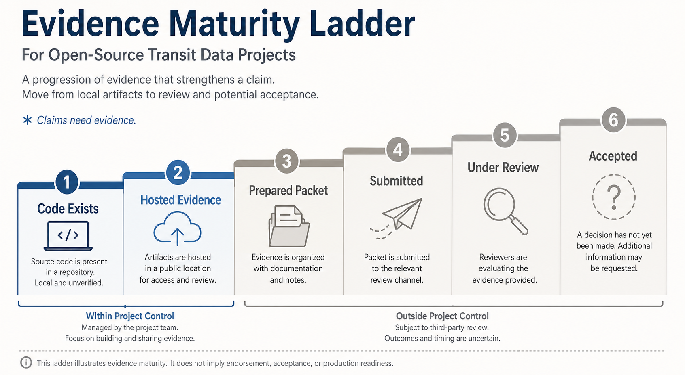

# Roadmap Status

This page gives a public-readable status summary without requiring readers to understand every phase handoff.

It does not claim CAL-ITP/Caltrans compliance, consumer acceptance, agency endorsement, hosted SaaS availability, paid support, SLA coverage, marketplace/vendor equivalence, production-grade ETA quality, or universal production readiness.

## What Works Today

Open Transit RT has technical foundations for:

- importing static GTFS ZIP files;
- editing typed GTFS Studio drafts;
- publishing public schedule and GTFS Realtime feed paths;
- ingesting authenticated vehicle telemetry;
- conservative trip matching;
- Vehicle Positions publication;
- Trip Updates behind a prediction adapter;
- basic Alerts authoring and publication;
- validation records and scorecard workflows;
- local app packaging and pilot operations helpers;
- consumer packet preparation workflows.

## Evidence That Exists

Current evidence includes:

- local demo and validation workflows;
- hosted/operator evidence for the OCI pilot;
- replay fixtures and metrics that measure current realtime behavior;
- prepared consumer and aggregator packet drafts for seven targets;
- an operator workflow for official-path verification, pre-submission checks,
  evidence intake, and artifact redaction;
- redaction and evidence policies.

OCI pilot evidence is useful pilot evidence. It is not agency-owned production proof.

## What Remains Missing

The repo does not currently have:

- third-party consumer submission, review, acceptance, rejection, or blocker evidence;
- agency-owned stable URL/domain proof for the OCI pilot feed set;
- production-grade ETA quality evidence;
- full hosted multi-tenant implementation;
- paid support or SLA commitments;
- marketplace/vendor-equivalent service packaging.

## How To Interpret Prepared Packets

Prepared means a packet draft exists for operator review. Prepared does not mean submitted, under review, accepted, rejected, listed, ingested, or compliant.

Target status can move beyond `prepared` only when retained, redacted, target-originated evidence exists for that specific target and feed scope.

Artifact directories for target-originated evidence must remain README-only
until real redacted evidence exists.

## How To Interpret Replay Metrics

Phase 19 replay metrics measure current behavior against committed fixtures. They help catch regressions and document conservative handling of stale, ambiguous, and withheld cases.

Replay metrics do not prove production-grade ETA quality or consumer acceptance.

## Future Roadmap Meaning

Future phases describe intended work. They are not commitments to hosted service, support coverage, agency endorsement, or consumer acceptance.

Track B is the planned productization path for release, agency-owned deployment proof, real agency data onboarding, device/AVL integration guidance, setup UX, multi-agency isolation proof, operations hardening, realtime quality expansion, optional external predictor adapter evaluation, AVL/vendor adapter pilot work, authorized consumer submissions, agency pilot packaging, and public ecosystem outreach.

Phase 29A — External Predictor Adapter Evaluation is complete for contract and candidate-only feasibility review. Phase 29B — AVL / Vendor Adapter Pilot Implementation is complete for the synthetic dry-run adapter pilot scope. Phase 30 — Consumer Submission Execution closed as Outcome B — blocker-documented closure only because no authorized submission, official-path verification evidence, or target-originated artifact was available. Phase 31 — Agency Pilot Program Package is the recommended next implementation phase and must proceed from the prepared-only consumer state. It must not assume submission, review, acceptance, rejection, blocker, ingestion, listing, display, or adoption evidence exists.

Use `docs/track-b-productization-roadmap.md` for the forward roadmap, `docs/roadmap-post-phase-14.md` for historical post-Phase-14 context, and `docs/handoffs/latest.md` for the current handoff state.
