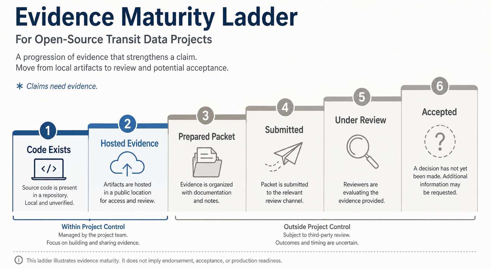

# Roadmap Status

This page gives a public-readable status summary without requiring readers to understand every phase handoff.

It does not claim CAL-ITP/Caltrans compliance, consumer acceptance, agency endorsement, hosted SaaS availability, paid support, SLA coverage, marketplace/vendor equivalence, production-grade ETA quality, or universal production readiness.



## What To Do Next

Phase 111 is complete for goal activation and the Phase 111-132 public release,
independent install confidence, Web Design Skill UX validation, and GTFS-RT
adoption roadmap pack. The closeout handoff is
[`docs/handoffs/phase-111.md`](handoffs/phase-111.md), and the roadmap lives at
[`docs/roadmaps/post-110-goal-public-release-install-ux/README.md`](roadmaps/post-110-goal-public-release-install-ux/README.md).
Phase 112 is complete for public release artifact and claim blocking audit.
The closeout handoff is [`docs/handoffs/phase-112.md`](handoffs/phase-112.md),
and `docs/release-status-v0.1.0-rc.1.md` records the current status:
`blocked_public_distribution_review`. Local package generation and audit
passed from a clean commit, but publication remains blocked because the source
archive contains tracked protected evidence and consumer-submission paths.
Phase 113 is complete for fresh clone install harness and release dry run.
The closeout handoff is [`docs/handoffs/phase-113.md`](handoffs/phase-113.md),
and `docs/install-confidence-v0.1.0-rc.1.md` records bounded local
fresh-clone and local source-archive install-confidence passes. Phase 114 is
complete for Web Design Skill UX audit and control-plane polish. The closeout
handoff is [`docs/handoffs/phase-114.md`](handoffs/phase-114.md), and the UX
artifact is
[`docs/ux/web-design-skill-review-phase-114.md`](ux/web-design-skill-review-phase-114.md).
Phase 115 is complete for the gated public `v0.1.0-rc.1` release-candidate
cut. The closeout handoff is
[`docs/handoffs/phase-115.md`](handoffs/phase-115.md), and the release status
artifact is
[`docs/release-status-v0.1.0-rc.1.md`](release-status-v0.1.0-rc.1.md).
The public GitHub prerelease is
[`v0.1.0-rc.1`](https://github.com/ptse8204/open-transit-rt/releases/tag/v0.1.0-rc.1),
draft `false`, prerelease `true`, and the tag dereferences to
`497f99a97baff630af147c83a7e1249bb08e32da`. Phase 116 is complete for
published release verification and download replay. The closeout handoff is
[`docs/handoffs/phase-116.md`](handoffs/phase-116.md), and the replay report
is
[`docs/release-download-replay-v0.1.0-rc.1.md`](release-download-replay-v0.1.0-rc.1.md).
Uploaded release assets downloaded and matched the published checksum
manifest, and uploaded/GitHub-generated archives had zero protected-path hits.
Extracted published rc1 source archives still fail `make check` because the
protected consumer tracker is correctly excluded while the rc1 tag still
requires it; the current repo is patched for future archives. Phase 117 is
complete for independent public fresh-clone install confidence. The closeout
handoff is [`docs/handoffs/phase-117.md`](handoffs/phase-117.md), and the
report is
[`docs/public-install-confidence-v0.1.0-rc.1.md`](public-install-confidence-v0.1.0-rc.1.md).
A public fresh clone of the rc1 tag passed `make check`, bootstrap preflight,
pinned validator install, `make validate`, `make test`, local app startup, and
all five local public feed fetches after the install-confidence harness was
patched to install validators before validate-enabled trials. Phase 118 is
complete for post-release Web Design Skill UX validation. The closeout handoff
is [`docs/handoffs/phase-118.md`](handoffs/phase-118.md), and the UX artifact
is
[`docs/ux/web-design-skill-review-phase-118.md`](ux/web-design-skill-review-phase-118.md).
The Web Design Skill was used, the public rc1 local app private Operations
Console was reviewed through authenticated HTML/JSON routes, and no Phase 118
code patch was required. Phase 119 is active for public docs, README, and
quickstart release alignment. This release remains a candidate for
local/self-hosted evaluation only and does not claim stable release readiness,
production readiness, compliance, adoption, consumer acceptance, final-root
readiness, hosted service availability, SLA/uptime, vendor compatibility,
hardware certification, or production-grade ETA quality.

Phase 110 remains complete for Long-Term Extensibility And Plugin Governance
in the authorized autonomous Phase 91-110 product roadmap. The closeout
handoff is [`docs/handoffs/phase-110.md`](handoffs/phase-110.md). Phase 110
added extension governance for the sidecar/manifest model, connector manifest
compatibility, public API stability, deprecation, security review, maintainer
release train planning, and post-110 roadmap guidance. It did not add dynamic
plugin loading, tag a release, create a GitHub Release, publish a package,
push an image, create evidence, move consumer status, contact external
parties, or claim release readiness, adoption, compliance, consumer
acceptance, final-root readiness, hosted service, SLA/uptime, production
readiness, vendor compatibility, hardware certification, or production-grade
ETA quality.

The authorized Phase 91-110 post-90 agency-grade GTFS-RT roadmap is complete.
The authorized post-110 work is now separated into the Phase 111-132 gated
track above.

Phase 108 is complete for Post-RC Bug Bash And Stabilization in the
authorized autonomous Phase 91-110 product roadmap. The closeout handoff is
[`docs/handoffs/phase-108.md`](handoffs/phase-108.md). Phase 108 refreshed
local release-candidate readiness guidance, updated the `v0.1.0-rc.1` draft
blocker matrix, reran route inventory in normal and strict-docs mode, reran
validation/tests/connector checks/local app diagnostics, and kept the
candidate at `needs_review`. It did not tag a release, create a GitHub
Release, publish a package, push an image, create evidence, move consumer
status, contact external parties, or claim release readiness, adoption,
compliance, consumer acceptance, final-root readiness, hosted service,
SLA/uptime, production readiness, vendor compatibility, hardware
certification, or production-grade ETA quality.

Phase 109 is complete for Optional Evidence Intake Gate Pack in the authorized
autonomous Phase 91-110 product roadmap. The closeout handoff is
[`docs/handoffs/phase-109.md`](handoffs/phase-109.md). Phase 109 added a
future evidence gate pack for final-root, consumer submission, real agency
pilot, real vendor/device AVL, real-world ETA-quality study, and compliance
packet gates. It did not collect evidence, contact external parties, fetch
final roots, write protected paths, move consumer statuses, use real
credentials or private data, publish release artifacts, or make stronger
public claims.

Phase 107 is complete for Public Docs/Site Freeze And Contributor Onboarding
in the authorized autonomous Phase 91-110 product roadmap. The closeout
handoff is [`docs/handoffs/phase-107.md`](handoffs/phase-107.md). Phase 107
refreshed architecture overview, added public docs/site freeze guidance, added
contributor first-issue guidance, added connector-contribution guidance, and
aligned README/docs/wiki/contributor links. It did not publish a site, create a
public launch, tag a release, create evidence, move consumer status, contact
external parties, or claim adoption, compliance, consumer acceptance,
final-root readiness, hosted service, SLA/uptime, production readiness, vendor
compatibility, hardware certification, release readiness, or production-grade
ETA quality.

Phase 106 is complete for Staff Training, Demo Datasets, And Adoption Kit in
the authorized autonomous Phase 91-110 product roadmap. The closeout handoff
is [`docs/handoffs/phase-106.md`](handoffs/phase-106.md). Phase 106 added a
private Help demo scenario catalog, trainer script, technical-helper
checklist, printable operator training guide updates, a staff-training tutorial
entry, and `testdata/training-demo/scenarios.json` over committed synthetic
fixtures. It did not add real agency data, real vendor/device data,
credentials, external contact, evidence writes, consumer-status movement,
adoption claims, agency-approval claims, consumer-acceptance claims,
compliance or release-readiness claims, final-root claims, hosted-service
claims, SLA/uptime claims, production-readiness claims, vendor claims,
hardware claims, public-launch claims, or production-grade ETA claims.

Phase 105 is complete for Multi-Agency Isolation And Operator Roles V2 in the
authorized autonomous Phase 91-110 product roadmap. The closeout handoff is
[`docs/handoffs/phase-105.md`](handoffs/phase-105.md). Phase 105 added
focused tests for no-store/escaped access denial, bounded non-HTML forbidden
responses, agency-scope conflict short-circuiting before audit data load,
tenant-safe public feed path routing, encoded slash/backslash agency rejection,
and per-agency debug JSON non-exposure. It also added metadata-only audit
browser counts over already-sanitized scoped rows. It did not add production
multi-tenant hosting, hosted identity, row-level security, public admin routes,
migrations, durable tenancy state, public feed contract changes, evidence
writes, consumer-status movement, hosted-service claims, SLA/uptime claims,
compliance or release-readiness claims, consumer-acceptance claims,
production-readiness claims, deployment-success claims, vendor claims,
hardware claims, final-root claims, public-launch claims, or production-grade
ETA claims.

Phase 104 is complete for Small-Host Deployment And Upgrade Hardening in the
authorized autonomous Phase 91-110 product roadmap. The closeout handoff is
[`docs/handoffs/phase-104.md`](handoffs/phase-104.md). Phase 104 added
bounded private small-host resource posture, service dependency review,
Caddy/proxy exposure posture, Postgres pool budget guidance, off-host validator
guidance, backup/restore env aliasing, protected repo evidence-output guards,
upgrade/rollback checklist posture, and private Maintenance Center rows over
those deployment-doctor categories. It did not add public admin routes,
migrations, durable deployment state, backup metadata tables, restore tables,
service-control actions, live backup/restore, live migration execution, real
public-root validation, evidence writes, consumer-status movement, deployment
success claims, hosted-service claims, SLA/uptime claims, compliance or
release-readiness claims, consumer-acceptance claims, production-readiness
claims, vendor claims, hardware claims, final-root claims, public-launch
claims, or production-grade ETA claims.

Phase 103 is complete for Monitoring, Notifications, And Export Surfaces in
the authorized autonomous Phase 91-110 product roadmap. The closeout handoff
is [`docs/handoffs/phase-103.md`](handoffs/phase-103.md). Phase 103 added
bounded private no-send health digest, channel guidance, monitoring export,
and private ops summary fields to existing `.cache` operations helpers, plus
a private Maintenance Center review panel. It did not add public admin routes,
migrations, durable notification state, delivery-attempt tables, schedulers,
queues, hosted monitoring backends, live webhook/email sends, destination
value rendering, evidence writes, consumer-status movement, hosted monitoring
claims, SLA/uptime claims, compliance or release-readiness claims,
consumer-acceptance claims, production-readiness claims, vendor claims,
hardware claims, public-launch claims, or production-grade ETA claims.

Phase 102 is complete for Device / AVL Fleet Onboarding V2 in the authorized
autonomous Phase 91-110 product roadmap. The closeout handoff is
[`docs/handoffs/phase-102.md`](handoffs/phase-102.md). Phase 102 added a
private metadata-only Fleet Onboarding V2 review to Device Credentials, with
inventory coverage, bulk onboarding planning, token lifecycle guidance,
freshness and unknown-device triage, binding review, and safe
technical-helper handoff. It did not add public admin routes, migrations,
durable fleet inventory schema, bulk token generation, token recovery, browser
token collection, unknown-device persistence, telemetry ingest contract
changes, public feed contract changes, evidence writes, consumer-status
movement, real vendor/device proof, vendor-compatibility claims,
hardware-certification claims, compliance or release-readiness claims,
production-readiness claims, hosted-service claims, SLA/uptime claims,
public-launch claims, or production-grade ETA claims.

Phase 101 is complete for Connector Maturity And Adapter Recipes V2 in the
authorized autonomous Phase 91-110 product roadmap. The closeout handoff is
[`docs/handoffs/phase-101.md`](handoffs/phase-101.md). Phase 101 added a
private Connector Workbench decision tree, redaction-first templates, manifest
lint summary rows, and 22-case offline synthetic adapter conformance coverage.
It did not add public admin routes, telemetry ingest contract changes, public
feed contract changes, Trip Updates hard-coupling, durable connector runtime
state, evidence writes, consumer-status movement, real vendor/device proof,
vendor-compatibility claims, hardware-certification claims, compliance or
release-readiness claims, production-readiness claims, hosted-service claims,
SLA/uptime claims, public-launch claims, or production-grade ETA claims.

Phase 100 is complete for Alerts Operations And Disruption Workflow in the
authorized autonomous Phase 91-110 product roadmap. The closeout handoff is
[`docs/handoffs/phase-100.md`](handoffs/phase-100.md). Phase 100 added
private Alerts Console lifecycle dashboard rows, canceled-trip reconciliation
guidance/form, disruption templates, GTFS-RT Alerts validation guidance,
missing-alert hints, public-feed usefulness review, and all-false claim flags.
It did not add public admin routes, public feed mutations, prediction adapter
coupling, evidence writes, consumer-status movement, public-launch claims,
consumer-acceptance claims, compliance/release-readiness claims, vendor
claims, hardware claims, hosted-service claims, or SLA/uptime claims.

Phase 99 is complete for Prediction / ETA Conformance And Backtesting V2 in
the authorized autonomous Phase 91-110 product roadmap. The closeout handoff
is [`docs/handoffs/phase-99.md`](handoffs/phase-99.md). Phase 99 added
aggregate synthetic conformance rows to realtime-quality backtest summaries,
a bounded private Prediction Lab conformance signal, and expanded public-safe
backtest fixtures for unknown/ambiguous withholding plus external predictor
fail-closed behavior. It did not add public feed mutations, raw observed-event
persistence, external predictor contact, evidence writes, consumer-status
movement, ETA-quality claims, real-world ETA accuracy claims, vendor claims,
hardware claims, SLA/uptime claims, or compliance/release-readiness claims.

Phase 98 is complete for Realtime Operations QA And Feed Usefulness in the
authorized autonomous Phase 91-110 product roadmap. The closeout handoff is
[`docs/handoffs/phase-98.md`](handoffs/phase-98.md). Phase 98 added private
diagnostic usefulness scoring for Vehicle Positions, Trip Updates, and Alerts,
freshness/lifecycle review rows, and consumer-safe omission rules. It did not
add public feed mutations, telemetry ingest mutation, prediction adapter
mutation, Alerts mutation, evidence writes, consumer-status movement,
SLA/uptime claims, ETA-quality claims, or compliance/release-readiness claims.

Phase 97 is complete for GTFS Quality Fix Planner And Safe Draft Suggestions.
The closeout handoff is [`docs/handoffs/phase-97.md`](handoffs/phase-97.md).
Phase 97 added private advisory fix planner rows, safe draft suggestion
guidance, before/after validation steps, and a copyable private checklist
derived from sanitized validator/importer groups. It did not add draft writes,
production GTFS edits, schedule publication, consumer-status movement,
retained evidence, or compliance/release-readiness claims.

Phase 96 is complete for GTFS Versioning, Diff, And Rollback Workbench. The
closeout handoff is [`docs/handoffs/phase-96.md`](handoffs/phase-96.md). Phase
96 added private active-vs-previous schedule comparison, file-level row-count
diffs, bounded route/stop/trip/service/frequency sample summaries, and
rollback-review guidance. It did not add rollback execution, publish
schedules, move consumer statuses, collect retained evidence, or claim
compliance/release readiness.

Phase 95 is complete for v0.1.0-rc.1 Candidate Cut. The closeout handoff is
[`docs/handoffs/phase-95.md`](handoffs/phase-95.md). Phase 95 generated and
audited a local `.cache` candidate source package, ran package-enabled local
app release-candidate diagnostics, refreshed draft release notes, and recorded
draft-only tag/GitHub Release text. It did not tag, publish, create a GitHub
Release, push an image, move consumer statuses, collect retained evidence, or
claim release readiness.

Phase 94 is complete for Operations Console Architecture Refactor. The
closeout handoff is
[`docs/handoffs/phase-94.md`](handoffs/phase-94.md). Phase 94 added a central
private Operations Console route registry, refactored nav/title generation to
use it, made the route inventory audit registry-backed, and fixed audit
coverage for `/admin/operations/checklist.json`.

Phase 93 is complete for Browser End-To-End Agency Task Trials. The closeout
handoff is
[`docs/handoffs/phase-93.md`](handoffs/phase-93.md). Phase 93 local/private
task trials covered new agency evaluator, operations staff, technical helper,
maintainer release reviewer, and connector evaluator flows. In-app Browser
automation was blocked locally by `net::ERR_BLOCKED_BY_CLIENT`, so
terminal-authenticated route checks and server-rendered UI tests were used as
the safe substitute.

Phase 92 is complete for Clean Checkout Release-Candidate Gate. The closeout
handoff is [`docs/handoffs/phase-92.md`](handoffs/phase-92.md). Phase 92 local
diagnostics passed where authorized, while package generation/audit, release
actions, publication, retained evidence, consumer action, and remote
reproduction remain not checked or blocked by scope; the conclusion is
`needs_review`, not release-ready.

Phase 91 is complete for Maintainer Route/Product Audit And Stabilization. The
closeout handoff is [`docs/handoffs/phase-91.md`](handoffs/phase-91.md).

Phase 90 remains complete for the Final Control Plane Closeout And Future
Evidence Gate Stubs scope in the authorized Phase 75-90 Consumer-Grade Control
Plane track. The final status artifact is
[`docs/phase-90-control-plane-final-status.md`](phase-90-control-plane-final-status.md)
and the closeout handoff is
[`docs/handoffs/phase-90.md`](handoffs/phase-90.md).

Phases 75-90 are complete for maintainer review. Phase 72 still ended with
`needs_review` release-candidate diagnostics, not a release-ready pass. Phase
89 remains the current local `v0.1.0-rc.1` gate result and also closes as
`needs_review`. Phase 74 CP000008 remains the latest GitHub Pages publication
at commit `a8b250e`.

The Phase 91-110 autonomous run is closed. Future work should start from a new
maintainer instruction and the relevant gate below. Do not tag, publish, create
release artifacts, collect evidence, move consumer statuses, contact external
parties, or make public-launch, consumer-acceptance, compliance,
hosted-service, SLA/uptime, production, vendor, hardware, final-root, or
ETA-quality claims without separate authorization and supporting artifacts.

Recommended work remains separated into:

1. release-cut cleanup: a separately authorized release-candidate package/tag
   gate if a maintainer wants to pursue `v0.1.0-rc.1` release action;
2. connector maturity: continued synthetic/local hardening by default, with
   real vendor/device proof only when separately authorized;
3. optional evidence tracks: final-root proof, consumer submission, real
   agency pilot, real vendor/device AVL, real-world ETA-quality, or
   compliance packet work only with explicit written scope, retention,
   redaction, and stop rules;
4. future UI/product phases: private Operations Console refinements that do
   not require evidence collection or release publication.

The Phase 72 plan lives at
[`docs/phase-72-v0.1.0-rc.1-release-candidate-hardening.md`](phase-72-v0.1.0-rc.1-release-candidate-hardening.md).
The Phase 73 plan lives at
[`docs/phase-73-agency-ui-acceptance-and-documentation-freeze.md`](phase-73-agency-ui-acceptance-and-documentation-freeze.md).
The Phase 74 plan lives at
[`docs/phase-74-github-pages-and-agency-ui-product-polish.md`](phase-74-github-pages-and-agency-ui-product-polish.md).
The release-candidate gate should prove that a clean checkout can run the
product-quality and external-connection checks below with clear blockers,
redaction rules, and no stronger public claims.

Real pilots, final-root proof, consumer submission, and vendor proof remain
optional evidence tracks only. Start one of those tracks only when a maintainer
has supplied explicit written authorization, the exact claim target, allowed
tools, public-safe retention rules, redaction rules, and stop conditions.

Useful visual documentation lives under:

- [product explainer site](https://ptse8204.github.io/open-transit-rt/)
- [product screenshots](assets/product-screenshots/README.md)
- [product diagrams](assets/product-diagrams/README.md)

Those assets are local/demo documentation aids only. They are not retained
evidence and do not prove production, compliance, adoption, consumer
acceptance, final-root readiness, vendor compatibility, or ETA quality.

## Review And Recommendations

This is the canonical review/recommendations section for the current post-60
project direction. Other docs should link here instead of duplicating the full
assessment.

### Main Weaknesses / Risks

| Area | Current risk | Product-quality next action |
| --- | --- | --- |
| Release maturity | Phase 92 completed a local clean-checkout RC gate: product validation, app/five-feed diagnostics, connector/backend diagnostics, and claim audits passed where authorized. No public release, clean tagged source state, package audit, or release-ready gate exists yet. | Treat the Phase 92 `needs_review` conclusion as the current release-candidate status; do not tag, package, publish, or claim release readiness without a later authorized release-cut gate. |
| Clean install confidence | Phase 92 raised confidence by running `make check`, `make validate`, `make test`, local app startup, and five public feed fetches from a clean local worktree. Remote reproduction still depends on maintainer publication of local commits. | Keep the Phase 92 local gate as the current signal; rerun it before any later release-cut action. |
| Product explanation | The repo now has public-friendly docs and a refreshed `gh-pages` documentation site that starts from browser review and `Agency Operations Cockpit / Start Here`. | Keep GitHub Pages content static, documentation-only, screenshot-bounded, and linked to deeper docs. |
| Browser-first operations | Phase 91 reconciled private route maps, added a local route inventory audit helper, and patched private no-store cache handling for legacy Operations pages. | Use `make audit-operations-route-inventory` before route-map or Operations Console IA changes. |
| Public GTFS trial repeatability | Public GTFS local/pilot handling exists, but it should be part of the RC review instead of a one-off proof story. | Run one public GTFS trial as a release-candidate diagnostic and record blockers without converting the run into compliance or adoption proof. |
| Tiny-server validation | Validators can be blocked by Java/Docker/runtime limits on small hosts. | Use `make validate-public-feeds` from an operator machine and keep validator results as supporting signals only. |
| Validator maturity | Validator health pages and scripts exist, but missing Java, Docker, pinned assets, or stale reports can still block review. | Use validator health and `make validate`; record exact blocker rows and keep validator output as a supporting signal only. |
| Telemetry/device path | The telemetry simulator and AVL adapter send mode exercise `POST /v1/telemetry`, but real device and vendor evidence is absent. | Keep using synthetic/local telemetry diagnostics; treat real device/vendor proof as optional evidence when authorized. |
| External predictor path | Deterministic Trip Updates are the safe default; external HTTP sidecars are optional and disabled by default. | Test external predictors only in shadow or fail-closed modes behind `internal/prediction.Adapter`. |
| Connector/adaptor conformance | Phase 72 CP000005 synthetic connector and adapter conformance checks passed locally, but real connector maturity remains evidence-limited. | Treat the local pass as synthetic only; real device/vendor validation and redaction review remain optional, authorization-gated follow-up work. |
| Claim discipline | The codebase is strong enough to invite overclaiming about compliance, adoption, consumer status, SaaS, production, vendors, or ETA quality. | Run the final claim audit and keep optional evidence tracks separate from default product work. |

### Scorecard

| Capability | Current assessment | Next gate |
| --- | --- | --- |
| Self-hosted GTFS/GTFS-RT backend | Strong local/product foundation for GTFS import/authoring, telemetry ingest, Vehicle Positions, pluggable Trip Updates, Alerts, validation, and private Operations Console workflows. | `v0.1.0-rc.1` clean-checkout review. |
| Release-candidate readiness | Phase 72 local diagnostics are complete with `needs_review` blockers/deferrals; CP000007 did not create a release-ready pass. | Clean checkout, release package audit, artifact metadata, and tag/publish decisions remain separate future release-cut work. |
| External-connection readiness | Promising but evidence-limited: sidecar/manifests/SDK-style examples exist for telemetry, prediction, validator, monitoring, and consumer/discovery boundaries. | AVL/device to `POST /v1/telemetry`, external predictor adapter shadow/fail-closed review, validator tooling, monitoring/export surfaces, feed-consumer URL/metadata expectations, and redaction checks. |
| Vehicle Positions | Product direction is strong because Vehicle Positions remain independent of external predictor availability. | Gate optional Vehicle Positions fields behind reliability, freshness, and consumer-safety checks; prefer omission over false certainty. |
| Trip Updates | Safe default exists through deterministic prediction and valid empty/fallback behavior. | Keep deterministic predictor as fallback; test external predictors only in shadow or fail-closed mode with sanitized DTOs and output validation. |
| Evidence/adoption/compliance claims | Evidence remains limited for external/adoption/compliance claims. | Treat real pilots, final-root proof, consumer submission, and vendor proof as optional evidence tracks when authorized. |

### Recommended Next Steps

1. Review the completed Phase 90 closeout and final status artifact.
2. Use the Phase 75
   [Consumer-Grade Control Plane roadmap pack](roadmaps/consumer-grade-control-plane/README.md)
   as the archived bounded guide for the completed Phase 75-90 track.
3. Treat Phase 72 CP000004 local app startup, private Operations Console route
   checks, and five local public feed fetches as complete local diagnostics
   only.
4. Treat Phase 72 CP000005 connector and adapter conformance checks as
   complete local synthetic diagnostics only.
5. Treat Phase 72 CP000006 release notes and Phase 72 CP000007 closeout as
   local pre-tag review artifacts only.
6. Keep release actions and optional evidence tracks separated by their phase
   gates and claim boundaries.
7. Cut a `v0.1.0-rc.1` review branch or tag candidate only after a later
   authorized release-cut gate passes the repo's release-candidate diagnostics.
8. For later authorized release-cut review, rerun the release-candidate
   readiness gate:

   ```bash
   git status --short
   make check
   make validate
   make test
   RUN_LOCAL_APP=true make release-candidate-check
   make external-connection-check
   make adapter-conformance
   PUBLIC_BASE_URL=https://feeds.example.org make validate-public-feeds
   PUBLIC_BASE_URL=https://feeds.example.org make oci-reference-check
   make audit-final-claim-review
   ```

9. Repeat the local app startup path and five public feed fetches only when a
   later checkpoint needs a fresh local signal:

   ```bash
   make agency-app-up
   curl -fsS http://localhost:8080/public/feeds.json >/tmp/open-transit-feeds.json
   curl -fsS http://localhost:8080/public/gtfs/schedule.zip >/tmp/open-transit-schedule.zip
   curl -fsS http://localhost:8080/public/gtfsrt/vehicle_positions.pb >/tmp/open-transit-vp.pb
   curl -fsS http://localhost:8080/public/gtfsrt/trip_updates.pb >/tmp/open-transit-tu.pb
   curl -fsS http://localhost:8080/public/gtfsrt/alerts.pb >/tmp/open-transit-alerts.pb
   make agency-app-down
   ```

10. Review the browser-first agency operations path when a later checkpoint
   needs a fresh local UI signal:

   ```text
   /admin/operations
   /admin/operations/setup-wizard
   /admin/operations/gtfs-import
   /admin/operations/realtime
   /admin/operations/feed-health
   /admin/operations/readiness
   /admin/operations/gtfs-quality
   /admin/operations/validation-health
   /admin/operations/devices
   /admin/operations/telemetry
   /admin/operations/telemetry-simulator
   /admin/operations/connectors
   /admin/operations/connectors/workbench
   /admin/operations/connectors/tests
   /admin/operations/maintenance
   /admin/operations/help
   ```

11. Run one public GTFS trial as a local diagnostic when network access and data
   terms allow:

   ```bash
   make agency-pilot-up AGENCY_ID=public-trial GTFS_URL=https://example.org/gtfs.zip
   ```

   Record exact blockers. Do not treat the run as final-root proof, agency
   adoption, consumer acceptance, or compliance evidence.

12. Exercise external-connection readiness with synthetic/local data:

   ```bash
   make telemetry-simulator
   make external-connection-check
   make adapter-conformance
   ```

13. Review these surfaces before improving public wording: validator health,
   monitoring/export diagnostics, feed URL and metadata expectations,
   connector/adaptor conformance, and redaction checks.
14. Keep all real pilots, final-root proof, consumer submission, and vendor
   proof as authorization-gated optional evidence tracks.

> **What this locally shows:** these checks can show that a local checkout has a
> coherent product-quality gate, repeatable diagnostics, safer connector
> boundaries, and clear blocker reporting.
>
> **What this does not prove:** these checks do not prove CAL-ITP/Caltrans
> compliance, consumer submission or acceptance, agency adoption or approval,
> agency-owned final-root readiness, hosted SaaS, paid support, SLA coverage,
> production readiness, vendor compatibility, hardware certification, or
> production-grade ETA quality.

### Final Assessment

Open Transit RT is a strong self-hosted GTFS/GTFS-RT backend for local
evaluation and operator-controlled deployments. Its best near-term path is to
raise product quality through a `v0.1.0-rc.1` release-candidate gate, then
continue hardening external connections around telemetry, predictors,
validators, monitoring/export, and feed-consumer metadata expectations.

The project is still evidence-limited for external, adoption, final-root,
consumer, compliance, hosted-service, vendor, and ETA-quality claims. That is a
claim boundary, not a product blocker: use the software, improve the product,
and keep optional evidence tracks separate until they are authorized and backed
by retained public-safe artifacts.

## What Works Today

Open Transit RT has technical foundations for:

- importing static GTFS ZIP files;
- editing typed GTFS Studio drafts;
- publishing public schedule and GTFS Realtime feed paths;
- ingesting authenticated vehicle telemetry;
- conservative trip matching;
- Vehicle Positions publication;
- Trip Updates behind a prediction adapter;
- basic Alerts authoring and publication;
- validation records and scorecard workflows;
- local app packaging and pilot operations helpers;
- reusable agency GTFS onboarding from an agency ID and GTFS URL;
- an integration adapter kit that maps telemetry, AVL, predictor, validator,
  monitoring, and consumer workflow boundaries;
- an authenticated CAL-ITP-style readiness workflow that shows readiness gaps,
  status sources, and next actions without compliance overclaims;
- a guided self-hosted operator trial that ties reference deployment,
  reusable onboarding, readiness review, validators, and the synthetic AVL
  dry-run together without creating evidence;
- operator smoke checks and redaction-safe support bundles for local/reference
  diagnostics without creating evidence;
- a synthetic telemetry simulator that uses real device-token auth and
  `POST /v1/telemetry` for local/reference diagnostics without creating
  evidence;
- a private synthetic AVL adapter send mode that posts transformed records to
  authenticated `POST /v1/telemetry` with env-referenced tokens and redacted
  `.cache/` diagnostics only;
- a local compliance/readiness packet generator and audit that writes ignored
  `.cache` summaries only;
- consumer packet preparation workflows.

## Evidence That Exists

Current evidence includes:

- local demo and validation workflows;
- hosted/operator evidence for the OCI pilot;
- Phase 33 Outcome C public GTFS local/pilot evidence for the May 6, 2026 LA
  Metro Bus GTFS run, with public-safe retained summaries;
- replay fixtures and metrics that measure current realtime behavior;
- prepared consumer and aggregator packet drafts for seven targets;
- an operator workflow for official-path verification, pre-submission checks,
  evidence intake, and artifact redaction;
- draft public launch materials for review;
- redaction and evidence policies.

OCI pilot evidence is useful pilot evidence. It is not agency-owned production proof.

## What Remains Missing

The repo does not currently have:

- third-party consumer submission, review, acceptance, rejection, or blocker evidence;
- agency-owned stable URL/domain proof for the OCI pilot feed set;
- validator-clean or no-warning static GTFS evidence for the Phase 33
  public-GTFS packet; a post-Phase-34 retry executed and reported 3 warning
  notices;
- production-grade ETA quality evidence;
- full hosted multi-tenant implementation;
- paid support or SLA commitments;
- marketplace/vendor-equivalent service packaging.

## How To Interpret Prepared Packets

Prepared means a packet draft exists for operator review. Prepared does not mean submitted, under review, accepted, rejected, listed, ingested, or compliant.

Target status can move beyond `prepared` only when retained, redacted, target-originated evidence exists for that specific target and feed scope.

Artifact directories for target-originated evidence must remain README-only
until real redacted evidence exists.

## How To Interpret Replay Metrics

Phase 19 replay metrics measure current behavior against committed fixtures. They help catch regressions and document conservative handling of stale, ambiguous, and withheld cases.

Replay metrics do not prove production-grade ETA quality or consumer acceptance.

## Future Roadmap Meaning

Future phases describe intended work. They are not commitments to hosted service, support coverage, agency endorsement, or consumer acceptance.

Track B is the planned productization path for release, agency onboarding,
device/AVL integration guidance, setup UX, multi-agency isolation proof,
operations hardening, realtime quality expansion, optional external predictor
adapter evaluation, AVL/vendor adapter pilot work, and truthful public
positioning.

Phase 29A — External Predictor Adapter Evaluation is complete for contract and
candidate-only feasibility review. Phase 29B — AVL / Vendor Adapter Pilot
Implementation is complete for the synthetic dry-run adapter pilot scope. Phase
30 — Consumer Submission Execution closed as Outcome B — blocker-documented
closure only because no authorized submission, official-path verification
evidence, or target-originated artifact was available. Phase 31 — Agency Pilot
Program Package is complete for the docs-only pilot package scope. Phase 32 —
Public Launch And Ecosystem Outreach is complete for draft public launch
materials only. Phase 32 did not post announcements, contact agencies, contact
consumers, or complete a public launch. Phase 33 — Public GTFS Local/Pilot
Evidence is complete as Outcome C — public-GTFS local/pilot run completed with
public-safe retained summaries for the May 6, 2026 LA Metro Bus GTFS local
attempt. The packet proves local/pilot handling of a real public static GTFS
dataset only; it does not prove agency adoption, final-root readiness, consumer
evidence, compliance, production readiness, real realtime data, or ETA quality.
Phase 34 — Post-Outcome-C Status Consistency And Evidence Readiness is complete
for docs-only status alignment, final-root request guidance, and public-GTFS
repeatability guidance; it created no new external evidence. Phase 35 — README
And Roadmap Realignment is complete for docs-only README and roadmap
realignment; it makes self-hosted agency reuse and OCI/OCL reference deployment
productization the default continuation path. Phase 36 — OCI/OCL Reference
Deployment Productization is complete for docs-only self-hosted reference
deployment guidance and created no external evidence. Phase 37 — Reusable
Agency Onboarding Flow is complete for the opt-in local/reference onboarding
command and docs. Phase 38 — Integration Adapter Kit is complete for the
central adapter map, synthetic fixture manifest, dry-run AVL examples, and
focused adapter conformance tests. Phase 39 — CAL-ITP-Style Readiness
Workflow is complete for the authenticated Operations Console readiness page
and documentation/navigation updates. Phase 40 — Guided Self-Hosted Operator
Trial is complete for the docs/navigation trial checklist that ties Phase 36
through Phase 39 workflows into one local/reference operator path without
creating evidence or stronger claims. Phase 41 — Operator Smoke And Support
Bundle is complete for repeatable local/reference smoke checks and
redaction-safe support bundles without creating evidence or stronger claims.
Phase 42 — Reference Deployment Doctor is complete for read-only OCI/OCL-style
reference deployment diagnostics without creating evidence or stronger claims.
Phase 43 — Operator UX Setup V2 is complete for the private authenticated
checklist and local routing patch scope. Phase 44 — Telemetry Simulator And
Device Trial is complete for the synthetic-only simulator that posts through
real authenticated telemetry ingest and optionally runs private DB-backed
matcher/Vehicle Positions diagnostics without creating evidence or stronger
claims. Phase 45 — GTFS Quality Triage Loop, Phase 46 — Validator Automation
And Health Gates, and Phase 47 — Self-Hosted Operations Notifications are
complete for private diagnostics and local/reference workflows without
creating evidence or stronger claims. Phase 48 — AVL Adapter Runtime Path is
complete for private send-mode execution through authenticated
`POST /v1/telemetry` with env-referenced tokens and redacted private
diagnostics only. Phase 49 — External Predictor Runtime Adapter is complete
for the optional disabled-by-default generic HTTP sidecar boundary behind
`internal/prediction.Adapter`, with sanitized DTOs, strict URL/token-env
validation, redacted diagnostics, and no named predictor, compatibility, or
ETA-quality claim. Phase 50 — Realtime Quality Backtesting is complete for
private aggregate diagnostics. Phase 51 — Operations Reliability And SLO
Readiness is complete for private authenticated reliability summaries,
bounded Vehicle Positions health persistence, and `.cache` reliability output
without evidence writes or stronger operational claims. Phase 52 — Final
Public Root Evidence Workflow closed blocker-only. Phase 53 — Authorized
Consumer Submission Execution closed blocker-only. Phase 54 — Official
Requirements Refresh updated official-source mappings only. Phase 55 —
Compliance Evidence Packet Generator is complete for ignored `.cache`
blocker/draft packet generation and audit without retained evidence, live feed
fetching, consumer contact, consumer status changes, or compliance claims.
Phase 56 — Multi-Agency Hosting Hardening, Phase 57 — Release Packaging And
Supply Chain, Phase 58 — Optional Marketplace / Vendor-Equivalent Pack, Phase
59 — Real Pilot Closeout, and Phase 60 — Final Claim Review And Public
Closeout are complete for their bounded scopes. Phase 60 added local claim
audit tooling and a final claim-to-evidence review only; it created no retained
evidence, changed no consumer statuses, and added no stronger claim.
Phase 61 — Agency-First UI And Connector Hub is complete for its bounded
product scope. It adopted the Phase 61+ roadmap naming, added the private
Connector Hub and agency-first Operations Console dashboard cards, and kept
connector/plugin wording limited to optional sidecars, manifests, command
adapters, or connector processes. Phase 61 created no evidence, changed no
consumer statuses, added no dynamic backend plugin loading, and made no
stronger claim.
Phase 62 — Guided Setup And Browser GTFS Import is complete for its bounded
private Operations Console scope. It added the setup wizard and admin-only
browser GTFS import flow without public routes, migrations, retained evidence,
consumer status changes, or stronger claims.
Phase 63 — Feed Health And Readiness UX is complete for its bounded private
Operations Console scope. It added the feed-health dashboard and readiness
checklist v2 for existing private signals without public routes, schema
changes, retained evidence, consumer status changes, or stronger claims.
Phase 64 — Connector Platform And SDKs is complete. Checkpoint 000001 added the
scoped connector platform and SDK plan. Checkpoint 000002 added the private
Connector Hub manifest registry UI from safe committed synthetic examples.
Checkpoint 000003 added private generated connector test instructions without
backend command execution. Checkpoint 000004 improved telemetry connector
SDK-style examples with a shared synthetic dry-run helper. Checkpoint 000005
improved the prediction connector SDK-style example with sanitized dry-run
request/response helpers and no-public-mutation diagnostics. Checkpoint
000006 improved monitoring/export examples and added a validator allowlist
example without dynamic backend plugin loading, evidence writes, consumer
status changes, raw validator commands, SLA/uptime claims, named predictor
compatibility claims, or production-grade ETA claims. Checkpoint 000007 closed
Phase 64 with validation, protected-path, consumer-tracker, and claim-boundary
review.
Phase 65 — Operator Workflow And Data Quality UX is complete. Checkpoint 000001
added the scoped plan for device/vehicle onboarding UI, telemetry simulator UI,
GTFS quality fix guidance, and closeout. Checkpoint 000002 improved the
private device and vehicle onboarding UI without changing device credential
semantics, telemetry ingest contracts, public routes, evidence paths, consumer
statuses, or stronger claims. Checkpoint 000003 added a private GET-only
telemetry simulator guide UI and JSON export without command execution, token
collection, `.cache` reads, telemetry sends, evidence writes, consumer status
changes, or stronger claims. Checkpoint 000004 improved private GTFS quality
guidance without automatic GTFS edits, draft mutation, schedule publish,
validator semantic changes, evidence writes, consumer status changes, or
stronger claims. Checkpoint 000005 closed Phase 65 with validation,
protected-path, consumer-tracker, and claim-boundary review.

Phase 66 — Release Candidate And Installability is complete. It added the
release-candidate and installability plan, prepared the first
release-candidate workflow, improved bootstrap/preflight UX, documented the
Docker image publishing decision as source/local-image only, added the
docs/demo site plan, and closed with validation, protected-path,
consumer-tracker, and claim-boundary review.
Phase 67 — Product Polish, Accessibility, and In-App Help is complete.
Checkpoint 000001 added the scoped product polish, accessibility, and in-app
help plan and aligned stale roadmap pointers so the Phase 61+ roadmap remains
the forward product path. Checkpoint 000002 improved the private Operations
Console information architecture with grouped navigation, active-page state,
route-stability tests, and a current Phase 61+ roadmap link from the
Launchpad decision gate. Checkpoint 000003 improved accessibility-oriented
shared markup, keyboard-visible focus styles, responsive/mobile constraints,
table overflow behavior, and explicit form labels/buttons without changing
runtime contracts. Checkpoint 000004 added private GET-only help routes,
static/derived help JSON, contextual Operations Console help panels, and
all-false help claim flags without creating evidence or changing consumer
statuses. Checkpoint 000005 closed Phase 67 with validation, protected-path,
consumer-tracker, and claim-boundary review.

Phase 68+ optional evidence-track readiness is authorization-gated. Without
explicit written authorization, a specific claim target, allowed tools,
public-safe retention and redaction rules, and stop conditions, the safe work
is blocker/scaffolding documentation only. It is not evidence collection.
After Checkpoint 000002, Phase 68+ is closed blocker-only /
authorization-gated for the current no-authorization review. It collected no
evidence, contacted no external party, fetched or verified no final public
root, moved no consumer or aggregator status, and did not change protected
evidence paths or consumer tracker status records. Optional future tracks
remain authorization-gated and require retained written intake before any real
evidence work starts.

Phase 69 — Maintainer Product Acceptance And UI-First Agency Usability Trial
is complete for its bounded product acceptance scope. It improved the private
Operations Console first-click label, Agency Operations Cockpit / Start Here,
browser-first small-agency walkthroughs, README/wiki/docs task navigation,
capability-versus-evidence wording, and local product acceptance audits without creating retained
evidence, contacting external parties, changing consumer statuses, or making
stronger compliance, adoption, acceptance, final-root, hosted SaaS,
production-readiness, vendor, SLA, or ETA-quality claims.

Phase 70 — GitHub Pages Product Explainer Site is complete for its bounded
documentation/product-site scope. It added a dependency-free static Pages site
on the `gh-pages` branch, local/demo UI screenshots in that site branch, and
links from the README, docs, and wiki. The main branch does not carry the Pages
workflow or static site payload. Phase 70 created no retained evidence,
contacted no external party, changed no consumer status, and made no stronger
compliance, adoption, acceptance, final-root, hosted SaaS, production-readiness,
vendor, SLA, or ETA-quality claim.

External-proof tracks such as agency-owned/final-root proof,
authorized target-specific consumer submission evidence, real agency pilot
evidence, real device/vendor AVL evidence, or real-world realtime quality
evidence remain future optional paths when retained claim-specific artifacts are
available. Do not make stronger public claims from Phase 33 beyond local/pilot
public-GTFS dataset handling. The Phase 61-70 roadmap execution is ready for
maintainer review as an agency-first connector platform and public explainer
path; that review state is not external evidence.

Use `docs/roadmaps/agency-first-connector-platform/README.md` for the Phase
61+ forward roadmap, `docs/track-b-productization-roadmap.md` for historical
Track B context, `docs/roadmap-post-phase-14.md` for older post-Phase-14
context, and `docs/handoffs/latest.md` for the current handoff state.
