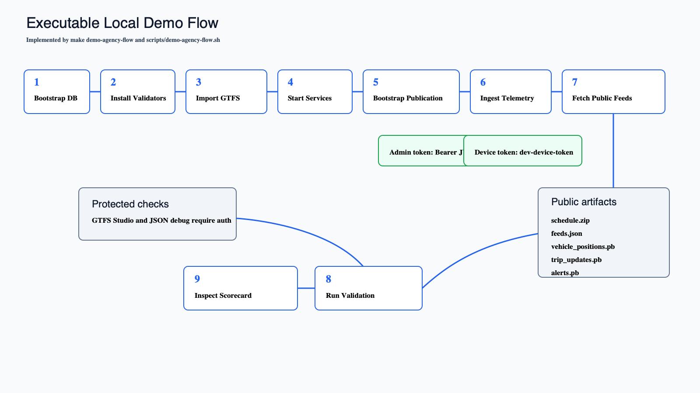

# Tutorials

These command-level tutorials are internal maintainer references. Public-facing versions live in [`/wiki`](../../wiki/README.md).

They document what the current repo can run today. They do not claim hosted production readiness, consumer acceptance, or completed CAL-ITP/Caltrans compliance.

*Exact-behavior flow diagram for `make demo-agency-flow`, rendered from a reviewed SVG spec.*

## Start Here

- [Agency First Run](agency-first-run.md): start the full local app package and understand the outputs.
- [Local Quickstart](local-quickstart.md): bring up the local development environment.
- [Agency Demo Flow](agency-demo-flow.md): run the executable agency/evaluator demo.
- [Deploy With Docker Compose](deploy-with-docker-compose.md): understand the current deployment path.
- [Production Checklist](production-checklist.md): review operational work still needed for a real deployment.
- [CAL-ITP Readiness Checklist](calitp-readiness-checklist.md): track readiness without overclaiming compliance.

For broader navigation, see [Docs Home](../README.md). For detailed evidence boundaries, see [Compliance Evidence Checklist](../compliance-evidence-checklist.md).

## Truthfulness Rules For Tutorial Edits

- Every command must be runnable from the committed repo or clearly marked as deployment-specific.
- Every endpoint and environment variable must match the actual codebase.
- Public protobuf endpoints are anonymous; JSON debug, admin, and GTFS Studio routes are protected.
- `http://localhost:8080` is local-demo packaging only; production deployments need HTTPS/TLS and deployment-owned admin network boundaries.
- Use "supports" and "technical foundations for" when describing compliance readiness unless deployment and external-consumer evidence supports stronger wording.
