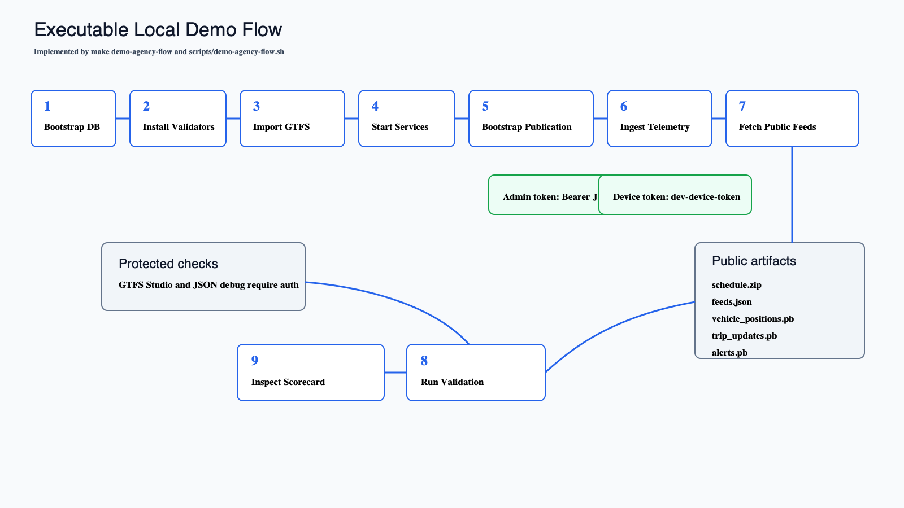

# Tutorials

These command-level tutorials are internal maintainer references. Public-facing versions live in [`/wiki`](../../wiki/README.md).

They document what the current repo can run today. They do not claim hosted production readiness, consumer acceptance, or completed CAL-ITP/Caltrans compliance.

*Exact-behavior flow diagram for `make demo-agency-flow`, rendered from a reviewed SVG spec.*

## Start Here

- [Agency First Run](agency-first-run.md): start the full local app package and understand the outputs.
- [Reusable Agency Onboarding](reusable-agency-onboarding.md): provide an agency ID and GTFS URL for local/reference onboarding without manual database edits.
- [Self-Hosted Operator Trial](self-hosted-operator-trial.md): run one guided local/reference evaluation across onboarding, public feed checks, readiness review, validators, and the synthetic AVL dry-run.
- [Operator Smoke And Support Bundle](operator-smoke-and-support-bundle.md): run strict smoke checks and collect redaction-safe diagnostics without creating evidence.
- [Reference Deployment Doctor](../deployment/reference-deployment-doctor.md): run read-only reference deployment diagnostics without creating evidence.
- [Phase 46 Validator Automation And Health Gates](../phase-46-validator-automation-and-health-gates.md): review private validator tooling, artifact, stale-result, and next-action diagnostics without creating evidence.
- [Telemetry Simulator And Device Trial](telemetry-simulator-and-device-trial.md): send synthetic telemetry through real authenticated ingest for local/reference diagnostics.
- [Real Agency GTFS Onboarding](real-agency-gtfs-onboarding.md): prepare, validate, review, and publish a real agency GTFS ZIP safely.
- [Public GTFS Local/Pilot Runbook](public-gtfs-local-pilot.md): repeat a real public GTFS local/pilot run without implying agency approval.
- [GTFS Validation Triage](gtfs-validation-triage.md): understand common import and validation failures and use the authenticated admin GTFS quality triage UI safely.
- [Integration Adapter Kit](../integration-adapter-kit.md): choose the correct telemetry, predictor, validator, monitoring, or consumer workflow boundary.
- [Device And AVL Integration](device-avl-integration.md): send authenticated telemetry from devices, vendors, adapters, or no-hardware simulator flows.
- [Device Token Lifecycle](device-token-lifecycle.md): rotate, rebind, store, and troubleshoot device bearer credentials safely.
- [Local Quickstart](local-quickstart.md): bring up the local development environment.
- [Agency Demo Flow](agency-demo-flow.md): run the executable agency/evaluator demo.
- [Deploy With Docker Compose](deploy-with-docker-compose.md): understand the current deployment path.
- [Production Checklist](production-checklist.md): review operational work still needed for a real deployment.
- [Small-Agency Pilot Operations](../runbooks/small-agency-pilot-operations.md): run the Phase 17 pilot operations profile.
- [OCI/OCL Reference Deployment](../deployment/oci-reference-deployment.md): reuse the self-hosted reference server pattern.
- [CAL-ITP Readiness Checklist](calitp-readiness-checklist.md): track readiness without overclaiming compliance.

For self-hosted deployment planning, see
[OCI/OCL Reference Deployment](../deployment/oci-reference-deployment.md),
[Self-Hosted Operator Trial](self-hosted-operator-trial.md),
[Operator Smoke And Support Bundle](operator-smoke-and-support-bundle.md),
[Reference Deployment Doctor](../deployment/reference-deployment-doctor.md),
[Small-Agency Pilot Operations](../runbooks/small-agency-pilot-operations.md),
the [Self-Hosted Agency Reuse Master Plan](../master-plan-self-hosted-agency-reuse.md),
and the closed [OCI/OCL Reference Deployment Productization](../phase-36-oci-reference-deployment-productization.md)
phase notes.

For broader navigation, see [Docs Home](../README.md). For detailed evidence boundaries, see [Compliance Evidence Checklist](../compliance-evidence-checklist.md).

## Truthfulness Rules For Tutorial Edits

- Every command must be runnable from the committed repo or clearly marked as deployment-specific.
- Every endpoint and environment variable must match the actual codebase.
- Public protobuf endpoints are anonymous; JSON debug, admin, and GTFS Studio routes are protected.
- `http://localhost:8080` is local-demo packaging only; production deployments need HTTPS/TLS and deployment-owned admin network boundaries.
- Use "supports" and "technical foundations for" when describing compliance readiness unless deployment and external-consumer evidence supports stronger wording.
