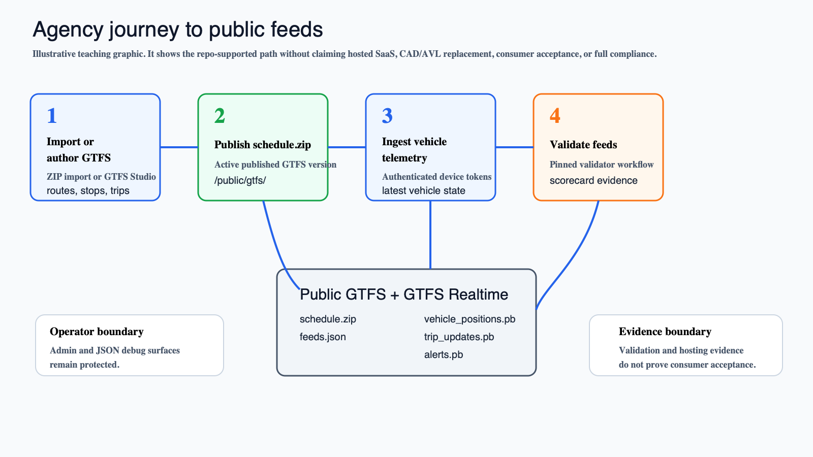
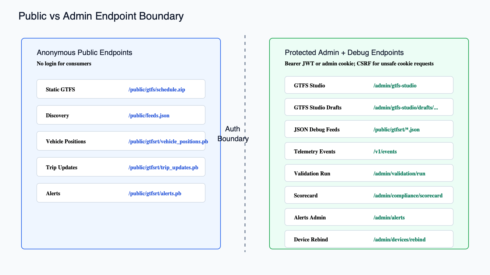

# Agency Demo Flow

This tutorial shows the repo-owned local demo for an agency or evaluator. It is executable from the repo and uses only current repository behavior.



*Illustrative teaching graphic, not a product screenshot. It summarizes the agency path exercised by the local demo.*

## Run The Demo

```bash
make demo-agency-flow
```

Task equivalent:

```bash
task demo:agency
```

Task is optional. Use `make demo-agency-flow` when Task is not installed.

## What The Demo Does

The wrapper script `scripts/demo-agency-flow.sh` performs these steps:

1. Starts Postgres/PostGIS with Docker Compose.
2. Applies migrations and seeds demo agencies, admin roles, and a device credential.
3. Installs and checks the pinned validators.
4. Creates a ZIP from `testdata/gtfs/valid-small`.
5. Imports the sample GTFS with `cmd/gtfs-import`.
6. Starts the current Go services.
7. Starts a temporary local public proxy on `http://localhost:8090`.
8. Generates a local admin JWT.
9. Bootstraps publication metadata.
10. Verifies protected admin/debug surfaces reject anonymous access.
11. Verifies protected GTFS Studio access with the admin JWT.
12. Ingests telemetry with the seeded device Bearer token.
13. Fetches and verifies public `schedule.zip`.
14. Fetches `feeds.json`.
15. Fetches Vehicle Positions, Trip Updates, and Alerts protobuf feeds.
16. Creates and publishes a simple Service Alert through the admin API.
17. Runs static and realtime validation flow through `/admin/validation/run`.
18. Reads the compliance scorecard and consumer-ingestion records.

The temporary local proxy exists only for the demo. It lets `PUBLIC_BASE_URL` and `FEED_BASE_URL` point at one public root while the underlying services still run on separate local ports.

## Verified Public URLs

The demo verifies these anonymous URLs through `http://localhost:8090`:

```text
/public/gtfs/schedule.zip
/public/feeds.json
/public/gtfsrt/vehicle_positions.pb
/public/gtfsrt/trip_updates.pb
/public/gtfsrt/alerts.pb
```

`schedule.zip` is fetched to a temporary file and checked with `unzip -t`.

The protobuf fetches verify non-empty responses. A non-empty protobuf response can still represent an empty valid GTFS Realtime feed if there are no publishable entities.

## Verified Protected Surfaces

The demo confirms anonymous requests return `401` for:

```text
/admin/compliance/scorecard
/v1/events
/public/gtfsrt/vehicle_positions.json
/public/gtfsrt/trip_updates.json
/public/gtfsrt/alerts.json
/admin/gtfs-studio
/admin/gtfs-studio/drafts/demo-draft
```

It then verifies `/admin/gtfs-studio` succeeds with `Authorization: Bearer $ADMIN_TOKEN`.

This explicitly covers the GTFS Studio admin boundary: the Studio root and draft subroutes are protected admin surfaces, not public pages.



*Exact-behavior endpoint boundary diagram rendered from a reviewed SVG spec.*

## Demo Credentials

The seeded local token and role bindings are development-only:

```text
admin subject=admin@example.com
agency_id=demo-agency
device_id=device-1
vehicle_id=bus-1
device token=dev-device-token
```

The script generates the admin token with:

```bash
go run ./cmd/admin-token -sub admin@example.com -agency-id demo-agency
```

Telemetry ingest uses:

```http
Authorization: Bearer dev-device-token
```

## What The Demo Does Not Prove

The demo does not prove:

- production hosting maturity
- HTTPS availability on a public domain
- consumer acceptance by Google Maps, Apple Maps, Transit App, or others
- learned ETA quality
- full CAL-ITP/Caltrans compliance
- a standalone automatic matcher daemon

It proves that the current repo can be bootstrapped, import sample GTFS, expose stable public feed paths through a demo proxy, require auth on protected surfaces, ingest token-authenticated telemetry, run validation flow, and show publication/readiness workflow records.

## Troubleshooting

If the demo fails while starting Postgres, confirm Docker is running:

```bash
docker compose -f deploy/docker-compose.yml ps
```

If validator install fails, run:

```bash
make validators-install
make validators-check
```

If a port is already in use, stop the local service using it or set a different `PUBLIC_PROXY_PORT` for the demo proxy. The Go service ports `8081` through `8086` are fixed by the script so it can verify exact endpoints.
