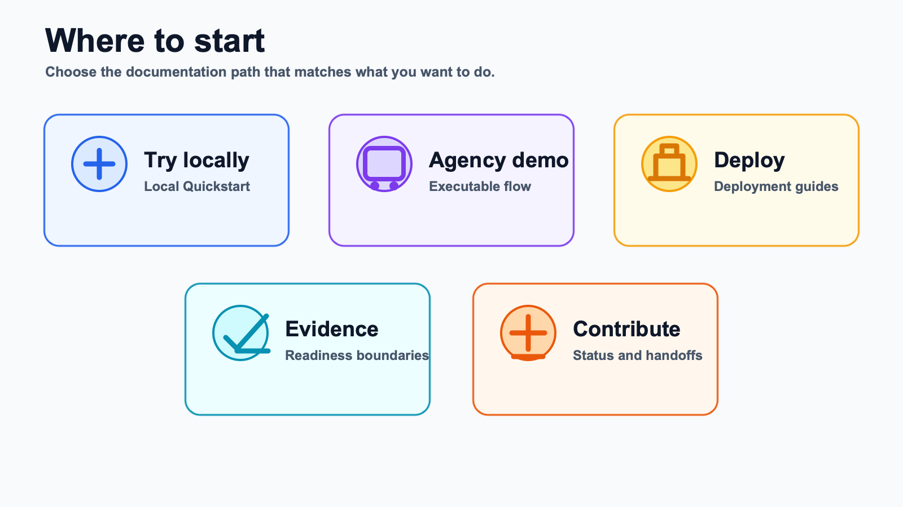

# Open Transit RT Wiki

Welcome. This wiki is the public guide for Open Transit RT.

Open Transit RT helps small transit agencies publish GTFS and GTFS Realtime feeds using open-source backend tools. It is not a hosted SaaS product, not a CAD/AVL replacement, and not proof of consumer acceptance by itself.

[⭐ Star the repo](https://github.com/ptse8204/open-transit-rt) if this work is useful to you.

*Illustrative docs navigation graphic, not an app screenshot.*

## Start Here

| If you want to... | Read this |
| --- | --- |
| 🧭 Understand the project | [How It Works](how-it-works.md) |
| 🚌 Start the local app package | [Agency First Run](../docs/tutorials/agency-first-run.md) |
| 💻 Try it on your machine | [Local Quickstart](local-quickstart.md) |
| 🚌 Run the agency demo | [Agency Demo](agency-demo.md) |
| 🚀 Plan a pilot deployment | [Deployment Guide](deployment-guide.md) |
| ✅ Review readiness and evidence | [Readiness And Evidence](readiness-and-evidence.md) |
| ⭐ Help improve the project | [Support And Contribute](support-and-contribute.md) |

## Important Boundaries

Open Transit RT can publish stable public feed paths for static GTFS, `feeds.json`, Vehicle Positions, Trip Updates, and Alerts. A real deployment still needs hosting, HTTPS, operations, validator evidence, agency-approved metadata, and consumer evidence before stronger readiness claims are appropriate.

For deeper implementation notes and maintainer references, see [docs](../docs/README.md).
