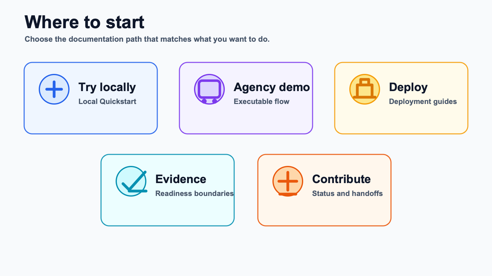

# Open Transit RT Wiki

Welcome. This wiki is the task-based public guide for Open Transit RT.

Open Transit RT helps small transit agencies, civic technologists, and
developer integrators evaluate a self-hosted path for GTFS and GTFS Realtime
operations. It is open-source software, not hosted SaaS, not a CAD/AVL
replacement, and not proof of agency approval or consumer acceptance.

Public product explainer site:
[https://ptse8204.github.io/open-transit-rt/](https://ptse8204.github.io/open-transit-rt/).

[Star the repo](https://github.com/ptse8204/open-transit-rt) if this work is
useful to you.



*Illustrative docs navigation graphic, not an app screenshot.*

## Agency Operations Cockpit / Start Here

1. [Small Agency Quick Start](small-agency-quick-start.md)
2. [Browser-First Setup](browser-first-setup.md)
3. [No Command Line First Run](../docs/tutorials/no-cli-agency-first-run.md)
4. [Small Agency Maintenance Guide](../docs/tutorials/small-agency-maintenance-guide.md)
5. [Operations Console Tour](operations-console-tour.md)
6. [Product Explainer Site](https://ptse8204.github.io/open-transit-rt/)
7. [Review And Recommendations](../docs/roadmap-status.md#review-and-recommendations)

No-developer review starts from the private local browser URL provided by a
technical helper, normally:

```text
http://localhost:8080/admin/operations
```

Click **Agency Operations Cockpit / Start Here** in the private Operations
Console.

Technical-helper startup command:

```bash
make agency-app-up
```

This command starts the local runtime. It is not the first step for
no-developer review.

## Browser-First Product Path

Use this same order everywhere:

1. Start in the browser.
2. Open **Agency Operations Cockpit / Start Here**.
3. Review setup.
4. Import or review GTFS.
5. Check the five configured feed URLs.
6. Review feed health, readiness, validation, telemetry, connectors, and
   maintenance.
7. Understand what remains before deployment or stronger claims.

## Private Operations Route Map

Keep these private routes findable during browser-first review:

```text
/admin/operations
/admin/operations/launchpad
/admin/operations/setup-wizard
/admin/operations/setup
/admin/operations/gtfs-workbench
/admin/operations/gtfs-import
/admin/operations/feeds
/admin/operations/feed-health
/admin/operations/gtfs-quality
/admin/operations/validation-health
/admin/operations/realtime
/admin/operations/prediction-lab
/admin/operations/devices
/admin/operations/telemetry
/admin/operations/telemetry-simulator
/admin/operations/connectors
/admin/operations/connectors/workbench
/admin/operations/connectors/tests
/admin/operations/validation-center
/admin/operations/readiness
/admin/operations/checklist
/admin/operations/reliability
/admin/operations/maintenance
/admin/operations/access
/admin/operations/audit
/admin/operations/help
/admin/operations/consumers
/admin/operations/evidence
```

Additional private diagnostic and compatibility routes:

```text
/admin/gtfs-studio
/admin/alerts/console
```

The current shell groups routes as Start Here, Schedule, Realtime, Connectors,
Health, Maintain, and Learn. Links to GTFS Studio and Alerts Console are marked
as separate private admin surfaces.

## Choose Your Task

| If you want to... | Read this |
| --- | --- |
| Decide whether this fits your agency or project | [Can My Agency Use This?](can-my-agency-use-this.md) |
| Try the browser-first local path | [Small Agency Quick Start](small-agency-quick-start.md) |
| Avoid command-line-first operations | [No Command Line First Run](../docs/tutorials/no-cli-agency-first-run.md) |
| Keep the system healthy week to week | [Small Agency Maintenance Guide](../docs/tutorials/small-agency-maintenance-guide.md) |
| Understand what to click in the private UI | [Operations Console Tour](operations-console-tour.md) |
| Use your own public GTFS ZIP | [Agency Evaluation Checklist](agency-adoption-checklist.md) |
| Connect GPS, AVL, CSV, or sidecar telemetry | [Connector Cookbook](connector-cookbook.md) |
| Review release-candidate and connector maturity | [Review And Recommendations](../docs/roadmap-status.md#review-and-recommendations) |
| Review CAL-ITP-style readiness plainly | [CAL-ITP Readiness Plain English](calitp-readiness-plain-english.md) |
| Understand readiness and evidence boundaries | [Readiness And Evidence](readiness-and-evidence.md) |
| Plan a self-hosted evaluator or reference deployment | [Deployment Guide](deployment-guide.md) |
| Help improve the project | [How Agencies Can Help](how-agencies-can-help.md) |
| Contribute code or docs | [Support And Contribute](support-and-contribute.md) |
| Pick a first issue | [Contributor First Issues](../docs/contributor-first-issues.md) |
| Contribute connector examples | [Contributing Connectors](../docs/connectors/contributing-connectors.md) |

## What You Can Do In The UI

- Follow the Agency Operations Cockpit / Start Here first-run path.
- Review setup and publication metadata.
- Import GTFS through the browser if you have an admin role.
- Check the five configured feed paths.
- Review feed health, GTFS quality, validation health, readiness, connectors,
  telemetry simulator guidance, Maintenance Center, and Help.

## What Still Needs A Technical Helper

You may need technical help for Docker setup, large GTFS imports, validator
installation, stable HTTPS deployment, device-token handling, custom GPS/AVL
connectors, and any future authorized evidence intake.

## Important Boundaries

Local UI evaluation does not prove CAL-ITP/Caltrans compliance, agency adoption
or approval, consumer acceptance, final-root readiness, hosted SaaS,
production readiness, vendor compatibility, SLA coverage, or production-grade
ETA quality.

Formal agency approval, final feed-root evidence, consumer acceptance, real
agency pilots, and vendor proof are optional future evidence tracks when
authorized. They are not required to use or improve the software.

## Contributor Path

Contributors should start with small, reviewable changes:

- docs and tutorial corrections;
- synthetic fixtures;
- focused tests;
- connector examples that use local or synthetic inputs;
- redaction and claim-boundary cleanup.

See [Contributor First Issues](../docs/contributor-first-issues.md),
[Contributing Connectors](../docs/connectors/contributing-connectors.md), and
[CONTRIBUTING.md](../CONTRIBUTING.md). Do not add real credentials, protected
evidence, private portal records, consumer status changes, or public launch
claims in contribution examples.

## Maintainers And Project History

For deeper implementation notes, handoffs, release-candidate checks, phase
history, and evidence/claim-boundary references, see [docs](../docs/README.md).
