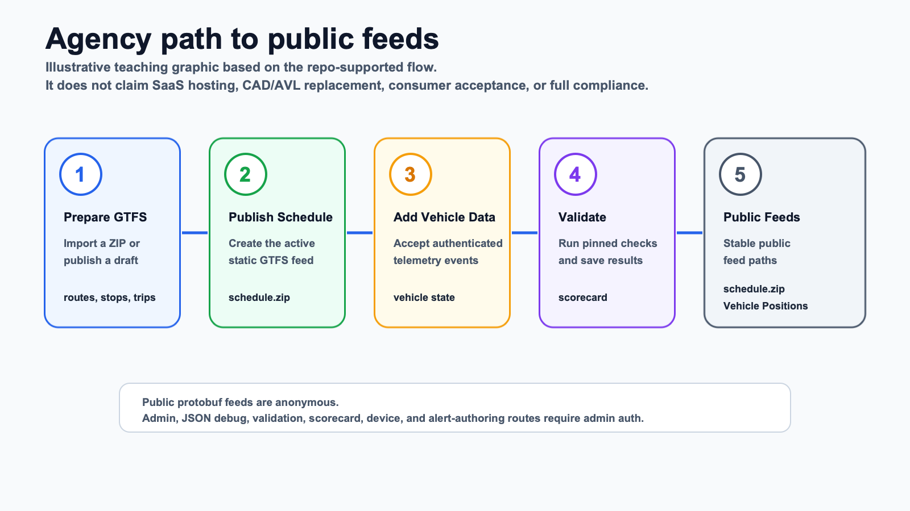

# Agency Demo

The agency demo is the fastest way to see the project working end to end in
about 30 minutes.

New to the project? Start with [Can My Agency Use This?](can-my-agency-use-this.md)
or go straight to [Local Quickstart](local-quickstart.md).



*Illustrative teaching graphic, not a product screenshot.*

## Run It

```bash
make demo-agency-flow
```

## What It Shows

The demo:

- starts the local database
- imports sample GTFS
- starts the Open Transit RT services
- creates local publication metadata
- ingests authenticated vehicle telemetry
- fetches public schedule and realtime feeds
- confirms protected admin/debug routes reject anonymous access
- runs validation flow
- reads scorecard and consumer-ingestion records

## Important Boundaries

The local demo shows the project flow on one machine. Production hosting, public HTTPS availability, consumer acceptance, learned ETA quality, and full CAL-ITP/Caltrans compliance require separate deployment and evidence work.

Formal agency approval, final feed-root evidence, and consumer acceptance are
not required to use or improve the software; they are future evidence
milestones only for agencies that choose public launch or compliance claims.

For the detailed script reference, see [docs/tutorials/agency-demo-flow.md](../docs/tutorials/agency-demo-flow.md).

## Next Steps

- 🚀 [Run a local/reference trial](agency-adoption-checklist.md)
- 🧩 [Connect GPS or AVL data](connector-cookbook.md)
- ✅ [Review readiness evidence](readiness-and-evidence.md)
- ⭐ [Support or contribute](support-and-contribute.md)
