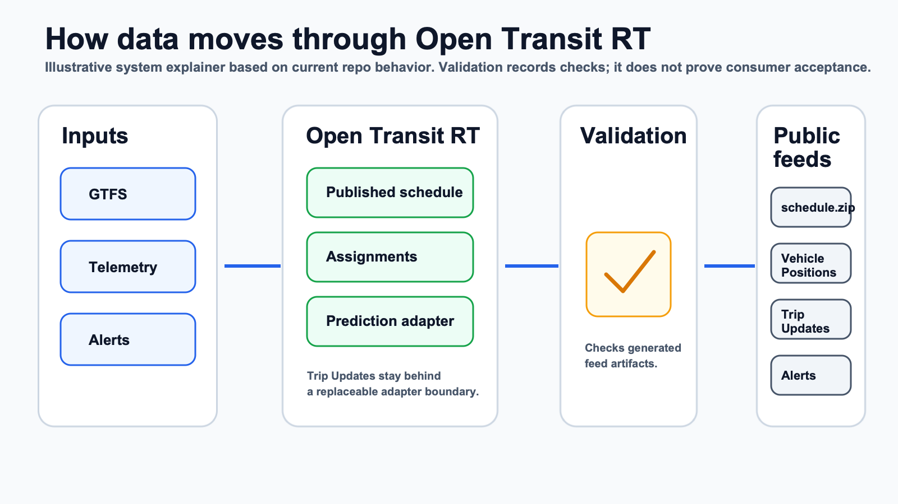

# How It Works

Open Transit RT is a backend toolkit for publishing transit data feeds.



*Illustrative system explainer based on current repo behavior. It is not a hosted deployment diagram and does not prove consumer acceptance or full compliance.*

## Main Pieces

- **GTFS import and GTFS Studio drafts** prepare the schedule data.
- **Published GTFS** becomes the active schedule used by public feed outputs.
- **Vehicle telemetry** is accepted from authenticated device tokens.
- **Assignments** preserve conservative vehicle-to-trip state.
- **Trip Updates** stay behind a replaceable prediction adapter.
- **Alerts** are published from persisted Service Alert records.
- **Validation** records feed checks and supports readiness review.

## Public Feed Paths

These feed paths are public by design:

```text
/public/gtfs/schedule.zip
/public/feeds.json
/public/gtfsrt/vehicle_positions.pb
/public/gtfsrt/trip_updates.pb
/public/gtfsrt/alerts.pb
```

Admin, JSON debug, validation, scorecard, device, and alert-authoring routes require admin access.
