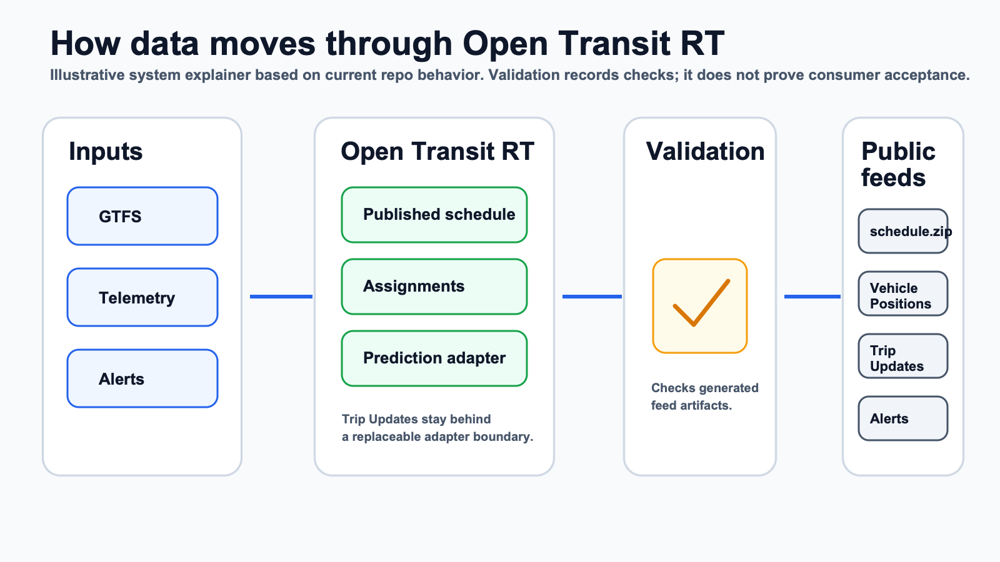

# How It Works

Open Transit RT is a backend toolkit for publishing transit data feeds. It is
designed around a plain lifecycle: prepare a schedule, publish stable feed
paths, ingest authenticated vehicle observations, match conservatively, and
review readiness without turning local diagnostics into stronger claims.



*Illustrative system explainer based on the project design. Hosted deployment details, consumer acceptance, and full compliance require separate evidence.*

## Lifecycle

1. **GTFS import or GTFS Studio draft.** Start from an uploaded or URL-based
   GTFS ZIP, or author schedule data in GTFS Studio drafts. Draft schedule data
   and published feed versions stay separate.
2. **Active schedule.** A published feed version becomes the active schedule
   used by feed builders, validation, matching, and readiness review.
3. **Public schedule ZIP.** The active schedule is served at
   `/public/gtfs/schedule.zip` and listed in `/public/feeds.json`.
4. **Authenticated telemetry.** GPS, AVL, CSV replay, device, or sidecar
   sources transform observations into `POST /v1/telemetry` with a device
   bearer token.
5. **Conservative matcher.** Matching considers service day, after-midnight
   trips, repeated trip instances, frequencies, block continuity, stale
   telemetry, and manual override state. Low-confidence cases stay unknown.
6. **Vehicle Positions.** The first high-quality realtime output is
   `/public/gtfsrt/vehicle_positions.pb`.
7. **Trip Updates adapter.** Trip Updates stay behind a prediction adapter.
   Deterministic prediction is the safe fallback path; external predictors must
   remain replaceable.
8. **Alerts.** Service Alerts publish from persisted alert records at
   `/public/gtfsrt/alerts.pb`.
9. **Validation and readiness.** Private validator, feed-health, readiness,
   connector, and release-candidate checks show local product posture and
   blockers. They are not compliance, adoption, final-root, or consumer
   acceptance evidence.

## Main Pieces

- **GTFS import and GTFS Studio drafts** prepare the schedule data.
- **Published GTFS** becomes the active schedule used by public feed outputs.
- **Vehicle telemetry** is accepted from authenticated device tokens.
- **Assignments** preserve conservative vehicle-to-trip state.
- **Trip Updates** stay behind a replaceable prediction adapter.
- **Alerts** are published from persisted Service Alert records.
- **Validation** records feed checks and supports readiness review.

## Public Feed Paths

These feed paths are public by design:

```text
/public/gtfs/schedule.zip
/public/feeds.json
/public/gtfsrt/vehicle_positions.pb
/public/gtfsrt/trip_updates.pb
/public/gtfsrt/alerts.pb
```

Admin, JSON debug, validation, scorecard, device, and alert-authoring routes require admin access.

## Next Steps

- [Try it locally](local-quickstart.md)
- [Run the agency demo](agency-demo.md)
- [Review the product explainer site](https://ptse8204.github.io/open-transit-rt/)
- [Plan a self-hosted evaluator deployment](deployment-guide.md)
