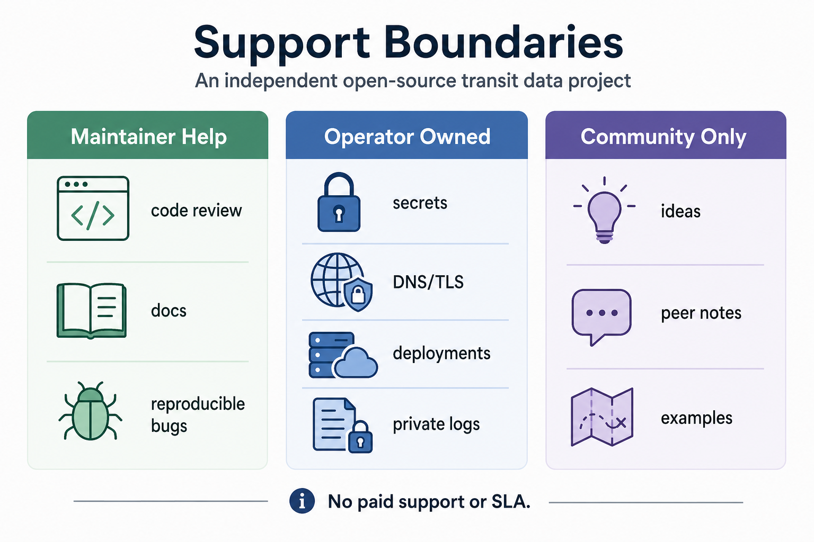

# Support And Contribute

Open Transit RT is an independent open-source project.

## Star The Repo

⭐ **[Star Open Transit RT on GitHub](https://github.com/ptse8204/open-transit-rt)** if this project is useful to you.

A GitHub star is a simple way to show support, similar to a like or bookmark. Stars help more people discover the project and support continued open-source work. A star is not an agency endorsement.

## Helpful Contributions

Useful contributions include:

- clear bug reports with commands and logs
- demo-flow failures that can be reproduced
- validator findings
- clearer docs
- deployment notes
- small-agency workflow feedback
- replay fixtures
- operator runbook improvements
- issue triage

Please keep requests inside the project boundary: GTFS import/Studio, telemetry ingest, deterministic matching, GTFS Realtime feeds, Alerts, validation, monitoring, and admin/operator workflows.

Do not post tokens, DB URLs, private keys, admin URLs with secrets, private portal screenshots, private ticket links, raw logs with credentials, or unredacted operator artifacts in public issues. Use redacted logs and public-safe evidence.

## Contributor And Support Docs

- [Contributing](../CONTRIBUTING.md)
- [Code Of Conduct](../CODE_OF_CONDUCT.md)
- [Support Boundaries](../docs/support-boundaries.md)
- [Governance](../docs/governance.md)
- [Roadmap Status](../docs/roadmap-status.md)

## Keep Exploring

- 🧭 [How It Works](how-it-works.md)
- 💻 [Local Quickstart](local-quickstart.md)
- ✅ [Readiness And Evidence](readiness-and-evidence.md)
